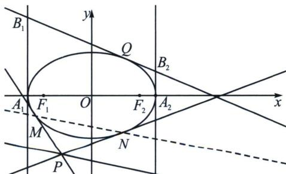

> [!faq]- 《圆锥曲线专题(上册)》例题解析
>
> > [!success]- **【答案】** ABD
>
> > [!note]- **【分析】**
> > 本题未单列分析。
>
> > [!note]- **【解析】**
> > 解析 对于 A，根据椭圆极点、极线定义，直线 l 关于椭圆 $\Gamma$ 存在极点，即为直线 MN 的定点，设极点为 $R(x_{0}, y_{0})$ ，则直线 l 的方程为 $\frac{xx_{0}}{9} + \frac{yy_{0}}{4} = 1$ ，又由于直线 l 的方程为： $2x + 3y + 12 = 0$ ，故直线 l 关于椭圆 $\Gamma$ 的极点（定点）为 $R\left(-\frac{3}{2}, -1\right)$ ，故 A 正确；
> > 
> > 对于 B，设 $Q(x_{1}, y_{1})$ ，则 Q 点处的切线方程为 $\frac{xx_{1}}{9} + \frac{yy_{1}}{4} = 1$ ，令 $x = \pm 3$ ，得 $B_{1} \left(-3, \frac{4(x_{1} + 3)}{3y_{1}}\right)$ ， $B_{2} \left(3, \frac{4(3 - x_{1})}{3y_{1}}\right)$ ，而 $F_{1}(-\sqrt{5}, 0)$ ，故 $\overrightarrow{F_{1}B_{1}} \cdot \overrightarrow{F_{1}B_{2}} = 0$ ，同理 $\overrightarrow{F_{2}B_{1}} \cdot \overrightarrow{F_{2}B_{2}} = 0$ ，即 $F_{1}, F_{2}, B_{1}, B_{2}$ 四点共圆，故 B 正确；
> > 对于 C，当 MNl 时，直线 MN 的方程为 $y = -\frac{2}{3}x - 2$ ，可以验证此时有 RM = RN（阿基米德三角形共中点定理），故 C 不正确；
> > 对于 D，由圆的相交弦定理和椭圆的光学性质可知 $\left|QB_{1}\right|\cdot\left|QB_{2}\right|=\left|QF_{1}\right|\cdot\left|QF_{2}\right|\leqslant\left(\frac{\left|QF_{1}\right|+\left|QF_{2}\right|}{2}\right)^{2}=9$ ，等号在 Q 为短轴端点时取到，故 D 正确。
> >
> > 故选 **ABD**.
