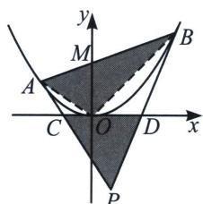
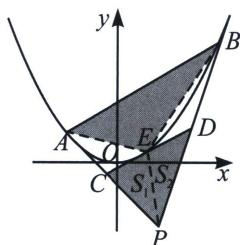
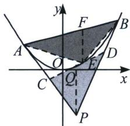

## 五、新定义下的阿基米德三角形的面积与等比数列

推论 1: 如左图, 阿基米德三角形 $PAB$ 中, $PA$ , $PB$ 分别交 $x$ 轴于点 $C$ , $D$ , 则有以下性质:

$$
① x _ {C} = \frac {x _ {1}}{2}, x _ {D} = \frac {x _ {2}}{2}; ② S _ {\triangle P C D} = \frac {| x _ {1} - x _ {2} |}{4} | y _ {P} | = \frac {\sqrt {x _ {p} ^ {2} - 2 p y _ {P}}}{2} | y _ {P} |, S _ {\triangle O A B} = \frac {| x _ {1} - x _ {2} |}{2} | y _ {M} | =
$$

$$
\sqrt {x _ {p} ^ {2} - 2 p y _ {P}} \cdot | y _ {P} |
$$

$$
③ S _ {A C D B} = S _ {\triangle P A B} - S _ {\triangle P C D} = \frac {\sqrt {(x _ {p} ^ {2} - 2 p y _ {p}) ^ {3}}}{p} - \frac {\sqrt {x _ {p} ^ {2} - 2 p y _ {P}}}{2} | y _ {P} | = \frac {\sqrt {x _ {p} ^ {2} - 2 p y _ {P}}}{2 p} (2 x _ {P} ^ {2} - 3 p y _ {P})
$$

证明：根据阿基米德三角形的求导、同构可知： $x_{1}+x_{2}=2x_{P}$ ， $x_{1}x_{2}=2py_{P}$ ， $y_{P}=-y_{M}$

①根据切线方程 $l_{PA}: xx_1 = p(y + y_1)$ 和 $l_{PB}: xx_2 = p(y + y_2)$ ，当 $y = 0$ 时，可得： $x_{C} = \frac{x_{1}}{2}, x_{D} = \frac{x_{2}}{2}$ ;

$$
② S _ {\triangle P C D} = \frac {1}{2} \cdot | x _ {D} - x _ {C} | \cdot | y _ {P} | = \frac {| x _ {1} - x _ {2} |}{4} | y _ {P} | = \frac {\sqrt {(x _ {1} + x _ {2}) ^ {2} - 4 x _ {1} x _ {2}}}{4} | y _ {P} | = \frac {\sqrt {x _ {p} ^ {2} - 2 p y _ {P}}}{2} | y _ {P} |,
$$

$$
S _ {\triangle O A B} = \frac {| x _ {1} - x _ {2} |}{2} | y _ {M} | = \frac {\sqrt {(x _ {1} + x _ {2}) ^ {2} - 4 x _ {1} x _ {2}}}{2} | y _ {M} | = \sqrt {x _ {p} ^ {2} - 2 p y _ {P}} \cdot | y _ {P} |;
$$

③参考阿基米德三角形面积公式： $S_{\triangle ABP}=\frac{\sqrt{(x_{P}^{2}-2py_{P})^{3}}}{p}$ ;

推论2: 如右图, 若 $E$ 为抛物线弧 $AB$ 上的动点, 点 $E$ 处的切线与 $PA$ , $PB$ 分别交于点 $C$ , $D$ , 则有 $\frac{|AC|}{|CP|} = \frac{|CE|}{|ED|} = \frac{|PD|}{|DB|}$ .

证明：由阿基米德三角形性质可知点 $P, C, D$ 的横坐标分别为 $x_{P} = \frac{x_{1} + x_{2}}{2}, x_{C} = \frac{x_{1} + x_{E}}{2}, x_{D} = \frac{x_{2} + x_{E}}{2}$ ，所以 $\frac{|AC|}{|CP|} = \frac{|x_C - x_1|}{|x_P - x_C|} = \frac{\left|\frac{x_1 + x_E}{2} - x_1\right|}{\left|\frac{x_1 + x_2}{2} - \frac{x_1 + x_E}{2}\right|} = \frac{|x_E - x_1|}{|x_2 - x_E|}, \frac{|CE|}{|ED|} = \frac{|x_E - x_C|}{|x_D - x_E|} = \frac{\left|x_E - \frac{x_1 + x_E}{2}\right|}{\left|\frac{x_E + x_2}{2} - x_E\right|} = \frac{|x_E - x_1|}{|x_2 - x_E|}$ ，所以 $\frac{|AC|}{|CP|} = \frac{|CE|}{|ED|}$ ，同理 $\frac{|PD|}{|DB|} = \frac{|CE|}{|ED|}$ ，故得 $\frac{|AC|}{|CP|} = \frac{|CE|}{|ED|} = \frac{|PD|}{|DB|}$ .

推论3: 若 $E$ 为抛物线弧 $AB$ 上的动点, 抛物线在点 $E$ 处的切线与阿基米德 $\triangle PAB$ 的边 $PA$ , $PB$ 分别交于点 $C$ , $D$ , 令 $S_{\triangle CPE} = S_1$ , $S_{\triangle DPE} = S_2$ , 则有 $S_{\triangle BDE}$ 、 $S_2$ 、 $S_1$ 、 $S_{\triangle ACE}$ 成等比数列.

证明：设 $\frac{|AC|}{|CP|} = \frac{|CE|}{|ED|} = \frac{|PD|}{|DB|} = \lambda$ ，则 $\frac{S_{\triangle ACE}}{S_1} = \frac{|AC|}{|CP|} = \lambda$ ，即 $S_{\triangle CAE} = \lambda S_1$ ，同理 $S_2 = \frac{S_1}{\lambda}$ ， $S_{\triangle BDE} = \frac{S_2}{\lambda}$ ，故 $S_{\triangle BDE}$ 、 $S_2$ 、 $S_1$ 、 $S_{\triangle ACE}$ 成公比为 $\lambda$ 的等比数列.

推论 4: $\frac{S_{\triangle EAB}}{S_{\triangle PCD}}=2.$

证明：解法一：因为 $\frac{S_{\triangle PAB}}{S_{\triangle PCD}} = \frac{|PA| \cdot |PB|}{|PC| \cdot |PD|} = \frac{\lambda + 1}{1} \cdot \frac{1 + \lambda}{\lambda} = \frac{(\lambda + 1)^2}{\lambda}$ ，所以 $S_{\triangle PAB} = (\lambda + \frac{1}{\lambda} + 2)(S_1 + S_2)$ ，所以 $S_{\triangle EAB} = S_{\triangle PAB} - S_{\triangle PCD} - S_{\triangle CAE} - S_{\triangle DBE} = (\lambda + \frac{1}{\lambda} + 2)(S_1 + S_2) - (S_1 + S_2) - \lambda S_1 - \frac{S_2}{\lambda} = S_1 + S_2 + \frac{S_1}{\lambda} + \lambda S_2$ ，即 $S_{\triangle EAB} = 2(S_1 + S_2)$ ，所以 $\frac{S_{\triangle EAB}}{S_{\triangle PCD}} = 2.$

解法二：如图，根据 $x_{P} = \frac{x_{1} + x_{2}}{2}$ ， $x_{C} = \frac{x_{1} + x_{E}}{2}$ ， $x_{D} = \frac{x_{2} + x_{E}}{2}$ ，分别作 $y$ 轴平行线 $PQ$ 和 $EF$ 分别交 $CD$ 和 $AB$ 于 $Q$ 和 $F$ ，根据面积模型之水平宽和铅锤高乘积一半可知： $S_{\triangle PCD} = \frac{1}{2}|x_D - x_C|\cdot |y_Q - y_p| = \frac{1}{4}$ $|x_1 - x_2|\cdot |y_Q - y_p|$ ， $S_{\triangle EAB} = \frac{1}{2}|x_1 - x_2|\cdot |y_F - y_E|$ ，故只需证明 $|y_Q - y_P| = |y_F - y_E|$

根据 $l_{CD}$ : $xx_{E}=p(y+y_{E})$ ，当 $x=x_{P}$ 得： $y_{Q}=\frac{x_{P}x_{E}}{p}-y_{E},\quad|y_{Q}-y_{P}|=\left|\frac{x_{P}x_{E}}{p}-y_{E}-y_{P}\right|$ ;

由于 $l_{AB}: xx_P = p(y + y_P)$ ，当 $x = x_E$ 得： $y_F = \frac{x_P x_E}{p} - y_P, |y_F - y_E| = \left|\frac{x_P x_E}{p} - y_P - y_E\right|$ ，命题得证.

注意 推论2，推论3和推论4的证解法一更加适合做小题，解答大题时需要的是推论1和推论4的证法二，无需记忆结论，只要按照 $S = \frac{\text{水平宽} \times \text{铅锤高}}{2}$ 模型走下去，结合之前的阿基米德三角形结论即可.

![[高中/总复习/专题/2026版高中《mst老唐说题》圆锥曲线专题（数学）/上册/第04章_小题新题型与多选的综合题方法篇/第一节_切线与切点弦/五_新定义下的阿基米德三角形的面积与等比数列/例题/Q00048530.md]]
![[高中/总复习/专题/2026版高中《mst老唐说题》圆锥曲线专题（数学）/上册/第04章_小题新题型与多选的综合题方法篇/第一节_切线与切点弦/五_新定义下的阿基米德三角形的面积与等比数列/例题/Q00048531.md]]
![[高中/总复习/专题/2026版高中《mst老唐说题》圆锥曲线专题（数学）/上册/第04章_小题新题型与多选的综合题方法篇/第一节_切线与切点弦/五_新定义下的阿基米德三角形的面积与等比数列/例题/Q00048532.md]]
