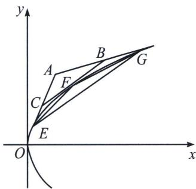
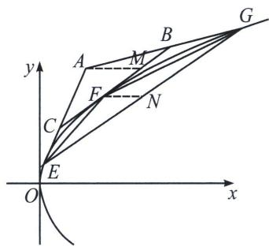

<!-- question-source:start -->
例19 (2024·深圳市期末)给出如下的定义和定理:

定义：若直线 l 与抛物线 $\Gamma$ 有且仅有一个公共点 P，且 l 与 $\Gamma$ 的对称轴不平行，则称直线 l 与抛物线 $\Gamma$ 相切，公共点 P 称为切点.

定理：过抛物线 $y^{2}=2px$ 上一点 $(x_{0}, y_{0})$ 处的切线方程为 $y_{0}y=px_{0}+px$ .

完成下述问题:

如图所示, 设 $E 、 F$ 是抛物线 $\Gamma: y^{2} = 2px (p > 0)$ 上两点. 过点 $E 、 F$ 分别作抛物线 $\Gamma$ 的两条切线 $l_{1} 、 l_{2}$ , 直线 $l_{1} 、 l_{2}$ 交于点 $C$ , 点 $A 、 B$ 分别在线段 $E C 、 C F$ 的延长线上, 且满足 $\overrightarrow{E C} = \lambda \overrightarrow{C A}, \overrightarrow{C F} = \lambda \overrightarrow{F B}$ , 其中 $\lambda > 0$ .

(1)若点 E、F 的纵坐标分别为 $y_{1}$ 、 $y_{2}$ ，用 $y_{1}$ 、 $y_{2}$ 和 p 表示点 C 的坐标；

(2)证明：直线 $AB$ 与抛物线 $\Gamma$ 相切；

(3)设直线 $AB$ 与抛物线 $\Gamma$ 相切于点 $G$ ，求 $\frac{S_{\triangle EFG}}{S_{\triangle ABC}}.$

(1) 因为点 $E, F$ 的纵坐标分别为 $y_{1}, y_{2}$ , 所以 $E(x_{1}, y_{1}), F(x_{2}, y_{2})$ , 所以在 $E(x_{1}, y_{1})$ 处的切线 $CE$ 方程为 $y_{1}y = p(x + x_{1})$ , 同理在 $F(x_{2}, y_{2})$ 处的切线 $CF$ 方程为 $yy_{2} = p(x + x_{2})$ , 直线 $AB$ 方程为 $yy_{C} = p(x + x_{C})$ , 利用直线两点式: $y - y_{1} = \frac{2p}{y_{1} + y_{2}} \left( x - \frac{y_{1}^{2}}{2p} \right)$ , 化简可得: $(y_{1} + y_{2})y = 2px + y_{1}y_{2}$ . 对比得: $x_{C} = \frac{y_{1}y_{2}}{2p}, y_{C} = \frac{y_{1} + y_{2}}{2}$ , 所以点 $C$ 的坐标为 $\left( \frac{y_{1}y_{2}}{2p}, \frac{y_{1} + y_{2}}{2} \right)$ .

(2)设 $G(x_0, y_0)$ 为抛物线上的一点，则 $x_0 = \frac{y_0^2}{2p}$ ，抛物线在点 $G(x_0, y_0)$ 处的切线方程为 $y_0y =$ $p\left(\frac{y_{0}^{2}}{2p}+x\right)$ ，令 $A'$ 为E处切线和G处切线得交点，由
(1)得 $x_{A}'=\frac{y_{1}y_{0}}{2p}$ ， $y_{A'}=\frac{y_{1}+y_{0}}{2}$ ，令 $B'$ 为F处切线和G处切线得交点，由 (1)，得 $x_{B}'=\frac{y_{2}y_{0}}{2p}$ ， $y_{B'}=\frac{y_{2}+y_{0}}{2}$ ，

$$
\overrightarrow {E C} = \left(\frac {y _ {1} y _ {2} - y _ {1} ^ {2}}{2 p}, \frac {y _ {2} - y _ {1}}{2}\right) = \frac {y _ {2} - y _ {1}}{2} \left(\frac {y _ {1}}{p}, 1\right), \overrightarrow {C A ^ {\prime}} = \left(\frac {y _ {1} y _ {0} - y _ {1} y _ {2}}{2 p}, \frac {y _ {0} - y _ {2}}{2}\right) = \frac {y _ {0} - y _ {2}}{2} \left(\frac {y _ {1}}{p}, 1\right),
$$

$$
\overrightarrow {C F} = \left(\frac {y _ {2} ^ {2} - y _ {1} v _ {2}}{2 p}, \frac {y _ {2} - y _ {1}}{2}\right) = \frac {y _ {2} - y _ {1}}{2} \left(\frac {y _ {2}}{p}, 1\right), \overrightarrow {F B ^ {\prime}} = \left(\frac {y _ {2} y _ {0} - y _ {2} ^ {2}}{2 p}, \frac {y _ {0} - y _ {2}}{2}\right) = \frac {y _ {0} - y _ {2}}{2} \left(\frac {y _ {2}}{p}, 1\right),
$$

所以 $\overrightarrow{EC} = \frac{y_2 - y_1}{y_0 - y_2}\overrightarrow{CA'}$ ， $\overrightarrow{CF} = \frac{y_2 - y_1}{y_0 - y_2}\overrightarrow{FB'}$ ，取 $\lambda = \frac{y_2 - y_1}{y_0 - y_2}$ ，则点 $A'$ 为点 $A$ ， $B'$ 为点 $B$ ，此时满足 $\overrightarrow{EC} = \lambda \overrightarrow{CA}$ ， $\overrightarrow{CF} = \lambda \overrightarrow{FB}$ ，所以直线 $AB$ 与抛物线 $\Gamma$ 相切；

(3)解法一: 因为 $\overrightarrow{EC} = \lambda \overrightarrow{CA}$ , $\overrightarrow{CF} = \lambda \overrightarrow{FB}$ , 所以 $\overrightarrow{BF} = \frac{1}{\lambda} \overrightarrow{FC}$ , 所以根据
(2) 可知, $\overrightarrow{GB} = \frac{1}{\lambda} \overrightarrow{BA}$ ,

所以 $\frac{S_{\triangle AEG}}{S_{\triangle ABC}} = \frac{|AG| \cdot |AE|}{|AB| \cdot |AC|} = (1 + \lambda) \cdot \frac{1 + \lambda}{\lambda} = \frac{(1 + \lambda)^2}{\lambda}$ ，所以 $\frac{S_{\text{四边形}ECBG}}{S_{\triangle ABC}} = \frac{(1 + \lambda)^2 - \lambda}{\lambda} = \frac{\lambda^2 + \lambda + 1}{\lambda}$ ，

$$
S _ {\triangle C E F} = \frac {| E C | \cdot | C F |}{| C A | \cdot | C B |} S _ {\triangle A B C} = \lambda \cdot \frac {\lambda}{1 + \lambda} S _ {\triangle A B C} = \frac {\lambda^ {2}}{1 + \lambda} S _ {\triangle A B C},
$$

$$
S _ {\triangle B G F} = \frac {| F B | \cdot | B G |}{| C B | \cdot | A B |} S _ {\triangle A B C} = \frac {1}{1 + \lambda} \cdot \frac {1}{\lambda} S _ {\triangle A B C} = \frac {1}{\lambda (1 + \lambda)} S _ {\triangle A B C},
$$

所以 $S_{\triangle EFG} = S_{\text{四切形}ECBG} - S_{\triangle CEF} - S_{\triangle BGF} = 2S_{\triangle ABC}$ ，所以 $\frac{S_{\triangle EFG}}{S_{\triangle ABC}} = 2.$
<!-- question-source:end -->

![[高中/总复习/专题/2026版高中《mst老唐说题》圆锥曲线专题（数学）/上册/第04章_小题新题型与多选的综合题方法篇/第一节_切线与切点弦/五_新定义下的阿基米德三角形的面积与等比数列/例题/answers/Q00048531A1.md]]
