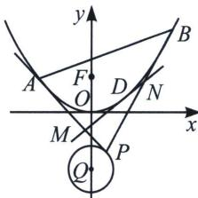

<!-- question-source:start -->
例18 (2024·苏州模拟)过抛物线外一点 $P$ 作抛物线的两条切线, 切点分别为 $A, B$ , 我们称 $\triangle PAB$ 为抛物线的阿基米德三角形, 弦 $AB$ 与抛物线所围成的封闭图形称为相应的“囧边形”, 且已知“囧边形”的面积恰为相应阿基米德三角形面积的三分之二. 如图, 点 $P$ 是圆 $Q: x^{2} + (y + 5)^{2} = 4$ 上的动点, $\triangle PAB$ 是抛物线 $\Gamma: x^{2} = 2py (p > 0)$ 的阿基米德三角形, $F$ 是抛物线 $\Gamma$ 的焦点, 且 $|PF|_{\min} = 6$ .

(1)求抛物线 $\Gamma$ 的方程;

(2)利用题给的结论，求图中“囧边形”面积的取值范围；

(3)设 D 是“囧边形”的抛物线弧 AB 上的任意一动点(异于 A, B 两点), 过 D 作抛物线的切线 l 交阿基米德三角形的两切线边 PA, PB 于 M, N, 证明: $\left|AM\right| \cdot \left|BN\right| = \left|PM\right| \cdot \left|PN\right|$ .

<!-- question-source:end -->

![[高中/总复习/专题/2026版高中《mst老唐说题》圆锥曲线专题（数学）/上册/第04章_小题新题型与多选的综合题方法篇/第一节_切线与切点弦/五_新定义下的阿基米德三角形的面积与等比数列/例题/answers/Q00052986A1.md]]
