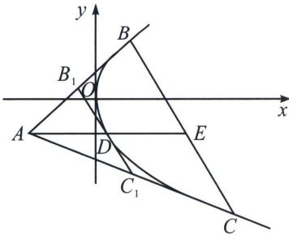
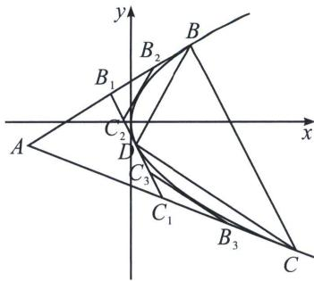

<!-- question-source:start -->
例20 (2024·江西模拟)已知抛物线 $\Gamma: y^{2} = 2x$ ，点 $R(x_{0}, y_{0}) (y_{0} \neq 0)$ 在抛物线 $\Gamma$ 上.

(1)证明：以 R 为切点的 $\Gamma$ 的切线的斜率为 $\frac{1}{y_{0}}$ ;

(2) 过 $\Gamma$ 外一点 $A$ (不在 $x$ 轴上) 作 $\Gamma$ 的切线 $AB$ 、 $AC$ , 点 $B$ 、 $C$ 为切点, 作平行于 $BC$ 的切线 $B_{1}C_{1}$ (切点为 $D$ ), 点 $B_{1}$ 、 $C_{1}$ 分别是与 $AB$ 、 $AC$ 的交点 (如图).

(i) 若直线 $AD$ 与 $BC$ 的交点为 $E$ , 证明: $D$ 是 $AE$ 的中点;

(ii) 设 $\triangle ABC$ 面积为 $S$ , 若将由过 $\Gamma$ 外一点的两条切线及第三条切线 (平行于两切线切点的连线) 围成的三角形叫做“切线三角形”, 如 $\triangle AB_{1}C_{1}$ . 再由点 $B_{1} 、 C_{1}$ 确定的切线 $\triangle B_{1}B_{2}C_{2}, \triangle C_{1}B_{3}C_{3}$ , 并依这样的方法不断作 $1, 2, 4, \cdots, 2^{n-1}$ 个切线三角形, 证明: 这些“切线三角形”的面积之和小于 $\frac{1}{3} S$ .

<!-- question-source:end -->

![[高中/总复习/专题/2026版高中《mst老唐说题》圆锥曲线专题（数学）/上册/第04章_小题新题型与多选的综合题方法篇/第一节_切线与切点弦/五_新定义下的阿基米德三角形的面积与等比数列/例题/answers/Q00052988A1.md]]
