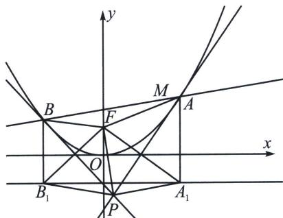

<!-- question-source:start -->
例17 (2025·多选·黑龙江模拟预测)已知抛物线 $C: x^{2} = 4y$ 的焦点为 $F, C$ 上不同两点 $A(x_{1}, y_{1})$ , $B(x_{2}, y_{2})$ , 以 $A, B$ 为切点的切线 $PA, PB$ 相交于点 $P, A, B, M(2, 2)$ 三点共线。下列说法正确的有（）

A. $|AM| \cdot |BM|$ 最小值为 4

B. $|PF|$ 的最小值为 $\frac{3}{2}$ C. 使得 $|AB| = 4\sqrt{2}$ 的直线有两条

D. $\angle PFA = \angle PFB$

$$
A B: y - 2 = k (x - 2)
$$

$$
x ^ {2} = 4 y
$$

$$
x ^ {2} - 4 k x + 8 k - 8 = 0
$$

则 $\Delta = (-4k)^2 - 4(8k - 8) = 16k^2 - 32k + 32 > 0$ ，所以 $x_A + x_B = 4k$ ， $x_A x_B = 8k - 8$ ，所以 $|AM||BM| = (1 + k^2)(x_A - 2)(x_B - 2)| = (1 + k^2)|x_A x_B - 2(x_A + x_B) + 4| = (1 + k^2)|8k - 8 - 8k + 4| = 4(1 + k^2) \geqslant 4$ ，当且仅当 $k = 0$ 等号成立，所以 $|AM|$

$$
| A M | \cdot | B M |
$$

故 A 正确；

由 $y = \frac{1}{4} x^2$ ，得 $y' = \frac{1}{2} x$ ，所以在点 $A$ 处的切线方程为 $y - y_1 = \frac{1}{2} x_1 (x - x_1)$ ，整理得： $y = \frac{1}{2} x_1 x - \frac{1}{4} x_1^2$ ，同理得在点 $B$ 处的切线方程为 $y = \frac{1}{2} x_2 x - \frac{1}{4} x_2^2$ ，两条切线方程联立得 $\left\{ \begin{aligned} & y = \frac{1}{2} x_2 x - \frac{1}{4} x_2^2 \\ & y = \frac{1}{2} x_1 x - \frac{1}{4} x_1^2 \end{aligned} \right.$ ，解得 $\left\{ \begin{aligned} & x = \frac{x_1 + x_2}{2} \\ & y = \frac{x_1 x_2}{4} \end{aligned} \right.$ ，即 $P\left( \frac{x_1 + x_2}{2}, \frac{x_1 x_2}{4} \right)$ ，由 $A, B, M$ 三点共线得： $(x_1 - 2)(y_2 - 2) - (x_2 - 2)(y_1 - 2) = 0 \Rightarrow x_1 y_2 - x_2 y_1 - 2(x_1 + y_2) + 2(x_2 + y_1) = 0 \Rightarrow \frac{x_1 x_2(x_2 - x_1)}{4} - 2(x_1 - x_2) + \frac{1}{2}(x_1^2 - x_2^2) = 0 \Rightarrow \frac{x_1 + x_2}{2} - \frac{x_1 x_2}{4} = 2$ ，所以点 $P$ 在直线 $x - y - 2 = 0$ 上，所以 $|FP|$ 的最小值为 $\frac{|-1 - 2|}{\sqrt{2}} = \frac{3\sqrt{2}}{2}$ ，故 $B$ 错误；

由题意可设直线 AB: $y-2=k(x-2)$ ，与 $x^{2}=4y$ 联立得： $x^{2}-4kx+8k-8=0$ ，

则 $\Delta=(-4k)^{2}-4(8k-8)=16k^{2}-32k+32>0,$

所以 $|AB| = \sqrt{1 + k^2} |x_A - x_B| = \sqrt{1 + k^2}\sqrt{\Delta} = 4\sqrt{(1 + k^2)(k^2 - 2k + 2)}$ ,

令 $f(k) = (1 + k^2)(k^2 - 2k + 2)$ ，则 $f'(x) = 2k(k^2 - 2k + 2) + (1 + k^2)(2k - 2) = 4k^3 - 6k^2 + 6k - 2$

令 $g(k)=f'(x)=4k^{3}-6k^{2}+6k-2$ ，则 $g'(k)=12k^{2}-12k+6>0$ ，所以 $f'(x)$ 在定义域 R 上单调递增，又 $f'\left(\frac{1}{2}\right)=0$ ，所以当 $k<\frac{1}{2}$ 时 $f'(x)<0$ ，则 $f(k)$ 在 $\left(-\infty,\frac{1}{2}\right)$ 上单调递减，当 $k>\frac{1}{2}$ 时 $f'(x)>0$ ，则 $f(k)$ 在 $\left(\frac{1}{2},+\infty\right)$ 上单调递增，所以 $f(k)$ 在 $k=\frac{1}{2}$ 时有最小值，此时 $|AB|_{\min}=5$ ，所以使得 $|AB|=4\sqrt{2}$ 的直线有两条，故 C 正确；

对于 D 选项，C: $x^{2}=4y$ 的准线方程为 y=-1，过 A 向准线作垂线，垂足为 $A_{1}$ ，

过 $B$ 做准线 $y = -1$ 的垂线，垂足为 $B_{1}$ ， $k_{FA_{1}} = -\frac{2}{x_{1}}$ ， $k_{PA} = \frac{x_{1}}{2}$ ，所以 $PA \perp FA_{1}$ ，

又 $\left|AA_{1}\right|=\left|AF\right|,\quad\left|PA_{1}\right|=\left|PF\right|$ ，同理 $\left|PB_{1}\right|=\left|PF\right|$ ，所以 $\angle PA_{1}B_{1}=\angle PB_{1}A_{1}$

所以 $\angle PFA = \angle PA_{1}B_{1} + \frac{\pi}{2} = \angle PB_{1}A_{1} + \frac{\pi}{2} = \angle PFB$ ，故D正确．故选ACD.
<!-- question-source:end -->
