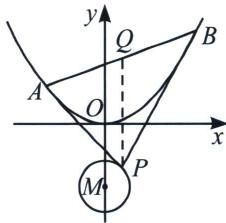

<!-- question-source:start -->
例15（2021·全国乙卷）已知抛物线 $C: x^{2} = 2py (p > 0)$ 的焦点为 $F$ ，且 $F$ 与圆 $M: x^{2} + (y + 4)^{2} = 1$ 上点的距离的最小值为 4.

(1)求 $p$ ;

(2)若点 $P$ 在 $M$ 上, $PA$ , $PB$ 为 $C$ 的两条切线, $A$ , $B$ 是切点, 求 $\triangle PAB$ 面积的最大值.

<!-- question-source:end -->

![[高中/总复习/专题/2026版高中《mst老唐说题》圆锥曲线专题（数学）/上册/第04章_小题新题型与多选的综合题方法篇/第一节_切线与切点弦/四_阿基米德三角形的面积问题/例题/answers/Q00052984A1.md]]
