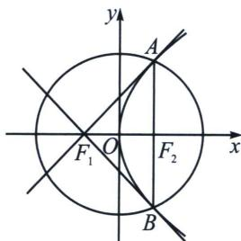

<!-- question-source:start -->
例5 (2025 高三专题练习)若抛物线 $E: y^{2} = 2px (p > 0)$ 的焦点与椭圆 $C: \frac{x^{2}}{a^{2}} + \frac{y^{2}}{b^{2}} = 1 (a > b > 0)$ 的右焦点重合, 设 $A, B$ 为抛物线 $E$ 与椭圆 $C$ 的两个交点, 且抛物线 $E$ 在点 $A$ 的切线过椭圆 $C$ 的左焦点, 则椭圆 $C$ 的离心率为 \_\_\_\_.

<!-- question-source:end -->

![[高中/总复习/专题/2026版高中《mst老唐说题》圆锥曲线专题（数学）/上册/第04章_小题新题型与多选的综合题方法篇/第三节_圆锥曲线之间的交点/一_由定义和交点坐标构造的混合型/例题/answers/Q00048553A1.md]]
