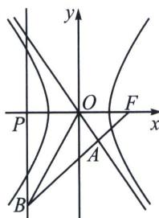

<!-- question-source:start -->
例7 (2025·天津河东二模)已知双曲线 $C_{1}: \frac{x^{2}}{a^{2}} - \frac{y^{2}}{b^{2}} = 1 (a > 0, b > 0)$ 的右焦点 $F$ 与抛物线 $C_{2}: y^{2} = 2px (p > 0)$ 的焦点重合，过 $F$ 的直线与双曲线 $C_{1}$ 的一条渐近线垂直且交于点 $A$ ， $FA$ 的延长线与抛物线 $C_{2}$ 的准线交于点 $B$ ， $\overrightarrow{FA} = \frac{1}{3}\overrightarrow{FB}$ ， $\triangle AOB$ 的面积为 $2\sqrt{2}$ ， $O$ 为原点，双曲线 $C_{1}$ 的方程为 ( )

A. $\frac{x^{2}}{4} - \frac{y^{2}}{2} = 1$ B. $\frac{x^{2}}{2} - \frac{y^{2}}{4} = 1$ C. $x^{2} - \frac{y^{2}}{2} = 1$ D. $\frac{x^{2}}{2} - y^{2} = 1$

<!-- question-source:end -->

![[高中/总复习/专题/2026版高中《mst老唐说题》圆锥曲线专题（数学）/上册/第04章_小题新题型与多选的综合题方法篇/第三节_圆锥曲线之间的交点/一_由定义和交点坐标构造的混合型/例题/answers/Q00048555A1.md]]
