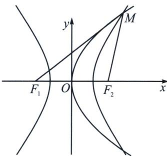
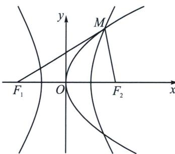

<!-- question-source:start -->
例8 (2025·多选·山东滨州二模)已知 $F_{1}, F_{2}$ 是双曲线 $C: \frac{x^{2}}{a^{2}} - \frac{y^{2}}{b^{2}} = 1 (a > 0, b > 0)$ 的左、右焦点、抛物线 $E: y^{2} = 2px (p > 0)$ 的焦点与双曲线 $C$ 的右焦点重合。且 $M$ 是双曲线 $C$ 与抛物线 $E$ 的一个公共点。若 $\triangle MF_{1}F_{2}$ 是等腰三角形，则双曲线 $C$ 的离心率为 ( )
A. $\sqrt{2} + 1$ B. $\sqrt{2} + 2$ C. $\sqrt{3} + 2$ D. $\sqrt{3} + 1$

<!-- question-source:end -->

![[高中/总复习/专题/2026版高中《mst老唐说题》圆锥曲线专题（数学）/上册/第04章_小题新题型与多选的综合题方法篇/第三节_圆锥曲线之间的交点/一_由定义和交点坐标构造的混合型/例题/answers/Q00048556A1.md]]
