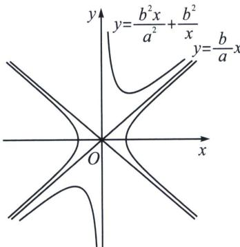

> [!faq]- 《圆锥曲线专题(上册)》例题解析
>
> > [!success]- **【答案】** B
>
> > [!note]- **【解析】**
> > 解析 曲线 $C_1: \frac{x^2}{a^2} - \frac{y^2}{b^2} = 1$ 的渐近线方程为： $y = \pm \frac{b}{a} x$ ， $C_2: \frac{x^2}{a^2} - \frac{xy}{b^2} = -1$ 可化简为： $y = \frac{b^2x}{a^2} + \frac{b^2}{x}$ ，所以曲线 $C_2$ 为双勾函数，其渐近线方程为 $y = \frac{b^2}{a^2} x$ ， $x = 0$ ，所以要使曲线 $C_1: \frac{x^2}{a^2} - \frac{y^2}{b^2} = 1$ 与曲线 $C_2: \frac{x^2}{a^2} - \frac{xy}{b^2} = -1$ 无公共点，如下图：
> >
> > 
> >
> > 则 $\frac{b^{2}}{a^{2}}\geqslant\frac{b}{a}$ ，解得： $\frac{b}{a}\geqslant1$ ，所以 $e=\frac{c}{a}=\sqrt{1+\left(\frac{b}{a}\right)^{2}}\geqslant\sqrt{2}$ ，所以线 $C_{1}$ 的离心率的取值范围为： $[\sqrt{2},+\infty)$ 。
> >
> > 故选 **B**.
