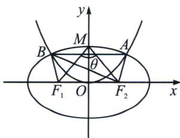

> [!faq]- 《圆锥曲线专题(上册)》例题解析
>
> > [!success]- **【答案】** $\left(\frac{\sqrt{5}}{5}, \frac{\sqrt{2}}{2}\right)$
>
> > [!note]- **【解析】**
> > 解析 如图，由椭圆与抛物线的对称性知点 $A, B$ 关于 $y$ 轴对称，四边形 $ABF_{1}F_{2}$ 是等腰梯形，易知四边形 $ABF_{1}F_{2}$ 的外接圆就是 $\triangle BF_{1}F_{2}$ 的外接圆，设四边形 $ABF_{1}F_{2}$ 的外接圆半径为 $R$ .
> >
> > 
> >
> > 在 $\triangle BF_{1}F_{2}$ 中，由正弦定理知 $\frac{2c}{\sin\angle F_{1}BF_{2}}=2R=\frac{5c}{2}$ ，所以 $\sin\angle F_{1}BF_{2}=\frac{4}{5}$ ，记椭圆的上顶点为 $M$ ， $\angle F_{1}MF_{2}=\theta$ ，坐标原点为 $O$ ，易知 $\angle F_{1}BF_{2}<\theta$ ，又 $b>c$ ，则 $\tan\frac{\theta}{2}=\tan\angle F_{1}MO=\frac{c}{b}<1$ ， $0<\frac{\theta}{2}<\frac{\pi}{2}$ ，所以 $0<\frac{\theta}{2}<\frac{\pi}{4}$ ，所以 $0<\theta<\frac{\pi}{2}$ ，即 $\theta$ 为锐角，所以 $\frac{4}{5}=\sin\angle F_{1}BF_{2}<\sin\theta$ ，又 $\sin\theta=\frac{2\sin\frac{\theta}{2}\cos\frac{\theta}{2}}{\sin^{2}\frac{\theta}{2}+\cos^{2}\frac{\theta}{2}}=\frac{2\tan\frac{\theta}{2}}{\tan^{2}\frac{\theta}{2}+1}$ ，所以 $\frac{2\tan\frac{\theta}{2}}{\tan^{2}\frac{\theta}{2}+1}>\frac{4}{5}$ ，所以 $\frac{1}{2}<\tan\frac{\theta}{2}<2$ 。又 $0<\frac{\theta}{2}<\frac{\pi}{4}$ ，所以 $\frac{1}{2}<\tan\frac{\theta}{2}<1$ ，所以 $\frac{1}{2}<\frac{c}{b}<1$ ，则 $\frac{1}{4}<\frac{c^{2}}{b^{2}}<1$ ，所以 $\frac{1}{4}<\frac{c^{2}}{a^{2}-c^{2}}<1 \Rightarrow 1<\frac{a^{2}-c^{2}}{c^{2}}<4 \Rightarrow 1<\frac{a^{2}}{c^{2}}-1<4$ ，所以 $2<\frac{a^{2}}{c^{2}}<5$ ，则 $\frac{\sqrt{5}}{5}<\frac{c}{a}<\frac{\sqrt{2}}{2}$ ，即 $\frac{\sqrt{5}}{5}<e<\frac{\sqrt{2}}{2}$ ，则椭圆的离心率的取值范围是 $\left(\frac{\sqrt{5}}{5}, \frac{\sqrt{2}}{2}\right)$ 。故答案为 $\left(\frac{\sqrt{5}}{5}, \frac{\sqrt{2}}{2}\right)$ 。
