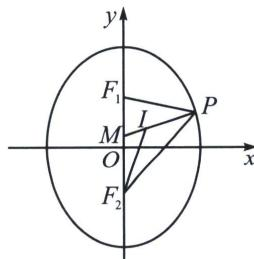

> [!faq]- 《圆锥曲线专题(上册)》例题解析
>
> > [!success]- **【答案】** 详见解析
>
> > [!note]- **【分析】**
> > 本题未单列分析。
>
> > [!note]- **【解析】**
> > 解析 $x^{2} = 2py(p > 0)$ 焦点在 $y$ 轴上，故椭圆 $\frac{x^2}{m} +\frac{y^2}{4} = 1(m > 0)$ 的焦点在 $y$ 轴上，故 $4 > m$
> > $I$ 是 $\triangle PF_{1}F_{2}$ 的内心，连接 $F_{2}I$ ，则 $F_{2}I$ 平分 $\angle F_{1}F_{2}P$ ，在 $\triangle PF_{2}I$ 中，由正弦定理得 $\frac{|PI|}{\sin\angle PIF_2I} = \frac{|PF_2|}{\sin\angle PIF_2}$ ①，在 $\triangle MF_{2}I$ ，由正弦定理得 $\frac{|MI|}{\sin\angle MF_2I} = \frac{|MF_2|}{\sin\angle MIF_2}$ ②，其中 $\angle MIF_{2} + \angle PIF_{2} = \pi$ ，故 $\sin \angle MIF_{2} = \sin \angle PIF_{2}$ ，又 $\sin \angle PF_{2}I = \sin \angle MF_{2}I$ ，式子①与②相除得 $\frac{|PI|}{|MI|} = \frac{|PF_2|}{|MF_2|}$ ，故 $\frac{|PF_2|}{|MF_2|} = 2$ ，同理可得 $\frac{|PI|}{|IM|} = \frac{|PF_1|}{|F_1M|} = 2,$
> > 
> > 所以 $|PF_1| + |PF_2| = 2|F_1M| + 2|F_2M|$ ，由椭圆定义可知 $|PF_1| + |PF_2| = 2a = 4$ ， $|F_1M| + |F_2M| = 2c$ ，所以 $2a = 4c$ ，所以 $c = 1$ ，即焦点坐标为 $(0, \pm 1)$ ，所以抛物线方程为 $x^2 = 4y$ ，在点 $(x_n, y_n)$ 的切线为： $x_n x = 2y + 2y_n$ ，令 $y = 0$ ， $x_{n+1} = \frac{2y_n}{x_n} = \frac{2 \times \frac{x_n^2}{4}}{x_n} = \frac{x_n}{2}$ ，又 $x_2 = \frac{x_1}{2} = 8$ ，即 $x_1 = 16$ ，所以 $\{x_n\}$ 是首项16，公比 $\frac{1}{2}$ 的等比数列，所以 $x_{2025} = 16 \times \left(\frac{1}{2}\right)^{2024} = \left(\frac{1}{2}\right)^{2020}$ ，故答案为 $\left(\frac{1}{2}\right)^{2020}$ .
