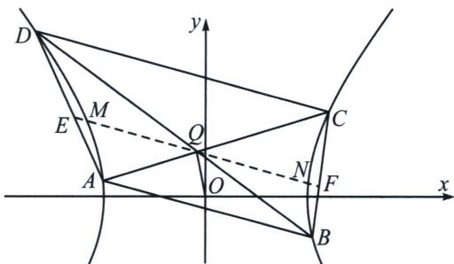

<!-- question-source:start -->
例15 (2025 广东省中学生数学奥林匹克竞赛一试第 9 题) 已知双曲线 $G: \frac{x^{2}}{a^{2}} - \frac{y^{2}}{b^{2}} = 1 (a > 0, b > 0)$ , 斜率为 $-\frac{1}{2}$ 的直线 $l$ 与 $G$ 的左右两支分别交于 $A, B$ 两点, 点 $Q(-1, 2)$ 不在 $l$ 上, 直线 $AQ$ 、 $BQ$ 分别交 $G$ 于另一点 $C, D$ , 若 $CD \parallel l$ , 则 $G$ 的离心率为 \_\_\_\_.

<!-- question-source:end -->

![[高中/总复习/专题/2026版高中《mst老唐说题》圆锥曲线专题（数学）/上册/第04章_小题新题型与多选的综合题方法篇/第三节_圆锥曲线之间的交点/三_由斜率关系和中点弦构造的混合型/例题/answers/Q00048563A1.md]]
