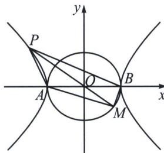

> [!faq]- 《圆锥曲线专题(上册)》例题解析
>
> > [!success]- **【答案】** A
>
> > [!note]- **【分析】**
> > 本题未单列分析。
>
> > [!note]- **【解析】**
> > 解析 如下图所示，不妨取 $A(-a, 0)$ ， $B(a, 0)$ 。设 $P(x_1, y_1)$ ， $M(x_2, y_2)$ 。因为动点 $M$ ， $P$ 满足 $\overrightarrow{AP} + \overrightarrow{BP} = \lambda (\overrightarrow{AM} + \overrightarrow{BM})$ ，
> > 
> > 可得 $2 \overrightarrow{OP} = \lambda 2 \overrightarrow{OM}$ ，即 $\overrightarrow{OP} = \lambda \overrightarrow{OM}$ ，所以 O、P、M 三点共线，
> > 故 $k_{1} + k_{2} = \frac{y_{1}}{x_{1} + a} +\frac{y_{1}}{x_{1} - a} = \frac{2x_{1}y_{1}}{x_{1}^{2} - a^{2}} = \frac{2x_{1}y_{1}}{a^{2} + \frac{a^{2}}{b^{2}}y_{1}^{2} - a^{2}} = \frac{2b^{2}}{a^{2}}\cdot \frac{x_{1}}{y_{1}}.$ 同理， $k_{3} + k_{4} = -\frac{2b^{2}}{a^{2}}\cdot \frac{x_{2}}{y_{2}}.$
> > 所以 $k_{1}+k_{2}+k_{3}+k_{4}=0$ 。
> >
> > 故选 **A**.
