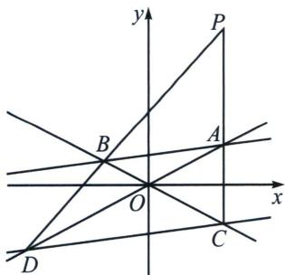
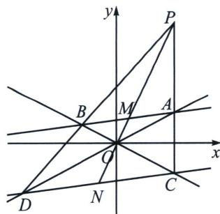

> [!faq]- 《圆锥曲线专题(上册)》例题解析
>
> > [!success]- **【答案】** $\frac{\sqrt{5}}{2}$
>
> > [!note]- **【解析】**
> > 解析 解法一：设双曲线的渐近线为 $y = \pm kx$ ， $k = \frac{b}{a} > 0$ ，且 $k \neq \frac{1}{8}$ ，直线 $AB: x = 8y + m$ ，直线 $CD$ ：
> >
> > $x = 8y + n$
> >
> > 
> >
> > 
> >
> > 联立 $\left\{\begin{aligned}y=kx\\ x=8y+m\end{aligned}\right.$ ，解得 $\left\{\begin{aligned}x=\frac{m}{1-8k}\\ y=\frac{mk}{1-8k}\end{aligned}\right.$ ，不妨令 $A\left(\frac{m}{1-8k},\frac{mk}{1-8k}\right)$ ，
> >
> > 联立 $\left\{\begin{aligned}y&=-kx\\ x&=8y+m\end{aligned}\right.$ ，解得 $\left\{\begin{aligned}x&=\frac{m}{1+8k}\\ y&=-\frac{mk}{1+8k}\end{aligned}\right.$ ，则 $B\left(\frac{m}{1+8k},-\frac{mk}{1+8k}\right)$ ，
> >
> > 同理可得： $C\left(\frac{n}{1+8k}, -\frac{nk}{1+8k}\right)$ ， $D\left(\frac{n}{1-8k}, \frac{nk}{1-8k}\right)$
> >
> > 又 $P(1,2)$ ，所以 $\overrightarrow{PA} = \left(\frac{m}{1 - 8k} -1,\frac{mk}{1 - 8k} -2\right),\overrightarrow{PC} = \left(\frac{n}{1 + 8k} -1, - \frac{nk}{1 + 8k} -2\right),$
> >
> > 由 $P, A, C$ 三点共线，可得 $\overrightarrow{PA} // \overrightarrow{PC}$ ，则 $\left(\frac{m}{1 - 8k} - 1\right)\left(-\frac{nk}{1 + 8k} - 2\right) = \left(\frac{mk}{1 - 8k} - 2\right)\left(\frac{n}{1 + 8k} - 1\right)$ ，
> >
> > 整理得： $2mnk=n(k+2)(1-8k)+m(k-2)(1+8k)$ ，同理，由P，B，D三点共线，可得 $2mnk=n(k-2)(1+8k)+m(k+2)(1-8k)$ ，
> >
> > 即 $n(k + 2)(1 - 8k) + m(k - 2)(1 + 8k) = n(k - 2)(1 + 8k) + m(k + 2)(1 - 8k)$
> >
> > 整理可得 $(m - n)(1 - 4k^2) = 0$ ，因为 $m\neq n$ ，所以 $m - n\neq 0$ ，则 $1 - 4k^{2} = 0$ ，解得 $k = \frac{1}{2}$ ，即 $\frac{b}{a} = \frac{1}{2}$
> >
> > 解法二(退化二次曲线联立): 取 $AB$ 中点 $M$ , $CD$ 中点 $N$ , 点差法易知 $k_{OM} k_{AB} = \frac{b^2}{a^2} = k_{ON} k_{CD}$ , 由于 $k_{AB} = k_{CD} = \frac{1}{8}$ , 所以 $P$ 、 $M$ 、 $N$ 、 $O$ 共线, 所以 $k_{OP} k_{AB} = \frac{b^2}{a^2} = \frac{1}{4}$ , 双曲线的离心率 $e = \frac{c}{a} = \sqrt{\frac{c^2}{a^2}} = \sqrt{\frac{a^2 + b^2}{a^2}} = \sqrt{1 + \left(\frac{b}{a}\right)^2} = \frac{\sqrt{5}}{2}$ . 故答案为 $\frac{\sqrt{5}}{2}$ .
