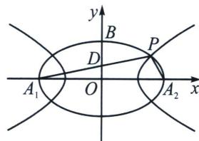

<!-- question-source:start -->
例9 (24-25 江苏常州高三下阶段练习)已知椭圆 $C: \frac{x^{2}}{a^{2}} + \frac{y^{2}}{b^{2}} = 1 (a > b > 0)$ 的短轴长为 4, 上顶点为 $B$ , $O$ 为坐标原点, 点 $D$ 为 $OB$ 的中点, 曲线 $E: \frac{x^{2}}{m^{2}} - \frac{y^{2}}{n^{2}} = 1 (m > 0, n > 0)$ 的左、右焦点分别与椭圆 $C$ 的左、右顶点 $A_{1}, A_{2}$ 重合, 点 $P$ 是双曲线 $E$ 与椭圆 $C$ 在第一象限的交点, 且 $A_{1}, P, D$ 三点共线, 直线 $PA_{2}$ 的斜率 $k_{PA_{2}} = -\frac{4}{3}$ , 则双曲线 $E$ 的实轴长为 \_\_\_\_.

<!-- question-source:end -->

![[高中/总复习/专题/2026版高中《mst老唐说题》圆锥曲线专题（数学）/上册/第04章_小题新题型与多选的综合题方法篇/第三节_圆锥曲线之间的交点/二_由斜率关系和共焦点构造的混合型/例题/answers/Q00048557A1.md]]
