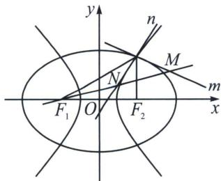

<!-- question-source:start -->
例10 (24-25·高三上安徽蚌埠期末)已知椭圆 $C_1$ 与双曲线 $C_2$ 有相同的焦点 $F_1(-2,0), F_2(2,0)$ , 点 $P(2,3)$ 是 $C_1$ 与 $C_2$ 的交点. 记椭圆 $C_1$ 在点 $P$ 处的切线为直线 $m$ , 双曲线 $C_2$ 在点 $P$ 处的切线为直线 $n$ , $\angle PF_1F_2$ 的平分线与 $m$ , $n$ 分别相交于点 $M$ , $N$ , 则 $\frac{|MF_1|}{|NF_1|} = \_$ .

<!-- question-source:end -->

![[高中/总复习/专题/2026版高中《mst老唐说题》圆锥曲线专题（数学）/上册/第04章_小题新题型与多选的综合题方法篇/第三节_圆锥曲线之间的交点/二_由斜率关系和共焦点构造的混合型/例题/answers/Q00048558A1.md]]
