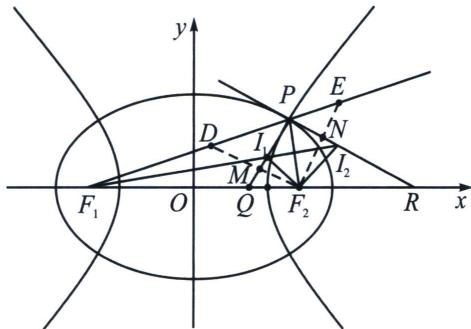

<!-- question-source:start -->
例11（24-25·多选·河北沧州高三上期末）椭圆 $C_{1}:\frac{x^{2}}{a_{1}^{2}} +\frac{y^{2}}{b_{1}^{2}} = 1(a_{1} > b_{1} > 0)$ 与双曲线 $C_2:\frac{x^2}{a_2^2} -\frac{y^2}{b_2^2} =$ $1(a_{2} > 0,b_{2} > 0)$ 有共同的左焦点 $F_{1}(-c,0)$ 和右焦点 $F_{2}(c,0)$ ， $C_{1}$ 与 $C_2$ 离心率分别为 $e_1,e_2$ ，它们在第一象限的交点为 $P(O$ 为坐标原点)，圆 $I_{1}$ 是 $\triangle F_{1}PF_{2}$ 的内切圆，过点 $P$ 且与直线 $PI_{1}$ 垂直的直线与 $F_{1}I_{1}$ 交于 $I_{2}$ ，则 （）

A. 当 $|F_{1}F_{2}| = 2|OP|$ 时， $\frac{1}{e_1^2} +\frac{1}{e_2^2} = 2$

B. 当 $\left|F_{1}F_{2}\right|=2\left|OP\right|$ 时， $\left|PI_{1}\right|+\left|PI_{2}\right|=\sqrt{2}(a_{1}-a_{2})$

C. $\left|F_{1}I_{2}\right|-\left|F_{1}I_{1}\right|=a_{1}-a_{2}$

D. 过右焦点 $F_{2}$ 分别作直线 $PI_{1}$ , $PI_{2}$ 的垂线, 垂足分别为 $M$ , $N$ , 则 $\vert ON \vert - \vert OM \vert = a_{1} - a_{2}$

<!-- question-source:end -->

![[高中/总复习/专题/2026版高中《mst老唐说题》圆锥曲线专题（数学）/上册/第04章_小题新题型与多选的综合题方法篇/第三节_圆锥曲线之间的交点/二_由斜率关系和共焦点构造的混合型/例题/answers/Q00048559A1.md]]
