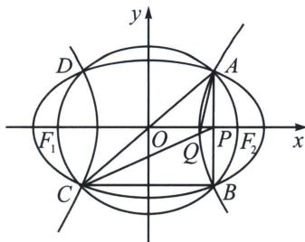

<!-- question-source:start -->
例12（2025·江西南昌模拟）如图，已知椭圆 $C_1$ 和双曲线 $C_2$ 具有相同的焦点 $F_1(-c, 0)$ ， $F_2(c, 0)$ ， $A$ 、 $B$ 、 $C$ 、 $D$ 是它们的公共点，且都在圆 $x^2 + y^2 = c^2$ 上，直线 $AB$ 与 $x$ 轴交于点 $P$ ，直线 $CP$ 与双曲线 $C_2$ 交于点 $Q$ ，记直线 $AC$ 、 $AQ$ 的斜率分别为 $k_1$ 、 $k_2$ ，若椭圆 $C_1$ 的离心率为 $\frac{2\sqrt{5}}{5}$ ，则 $k_1 \cdot k_2$ 的值为 （）

A. 2 B. $\frac{2}{3}$ C. $\frac{4}{3}$ D. 4
<!-- question-source:end -->

![[高中/总复习/专题/2026版高中《mst老唐说题》圆锥曲线专题（数学）/上册/第04章_小题新题型与多选的综合题方法篇/第三节_圆锥曲线之间的交点/二_由斜率关系和共焦点构造的混合型/例题/answers/Q00048560A1.md]]
