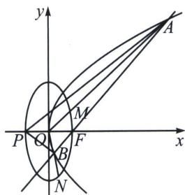

<!-- question-source:start -->
例16 (2025·黑龙江哈尔滨三模 T11)已知 O 为坐标原点，椭圆 $C_{1}:\frac{y^{2}}{a^{2}}+\frac{x^{2}}{b^{2}}=1(a>b>0)$ 的长轴长为 4，离心率为 $\frac{\sqrt{3}}{2}$ ，过抛物线 $C_{2}:y^{2}=4x$ 的焦点 F 作直线 l 交抛物线于 A，B 两点，连接 AO，BO 并分别延长交椭圆 $C_{1}$ 于 M，N 两点，则下列结论正确的是
A. 若 $\overrightarrow{AF}=2\overrightarrow{FB}$ ，则 $\left|AB\right|=\frac{9}{2}$ B. 若直线 OM, ON 的斜率分别为 $k_{1}$ , $k_{2}$ ，则 $k_{1}k_{2}=-\frac{1}{4}$ C. 若抛物线 $C_{2}$ 的准线与 x 轴交于点 P，直线 l 的倾斜角为 $45^{\circ}$ ，则 $\tan\angle APB=2\sqrt{2}$ D. $\frac{1}{|OM|} + \frac{1}{|ON|}$ 的最小值为 $\frac{2\sqrt{10}}{5}$ 解析 如图：对椭圆 $C_{1}:\begin{cases}a=2\\ \frac{c}{a}=\frac{\sqrt{3}}{2}\\ a^{2}=b^{2}+c^{2}\end{cases}\Rightarrow\begin{cases}a=2\\ c=\sqrt{3}\\ b=1\end{cases}$ ，所以椭圆 $C_{1}:\frac{y^{2}}{4}+x^{2}=1;$

对抛物线 $C_{2}$ ： $y^{2}=4x$ ，所以 $F(1,0)$ ， $P(-1,0)$ 。设 $A(x_{1},y_{1})$ ， $B(x_{2},y_{2})$ 。

对 A 选项： $|AF|=2|FB|\Rightarrow\frac{p}{1-\cos\theta}=\frac{2p}{1+\cos\theta}\Rightarrow\cos\theta=\frac{1}{3}$ ， $|AB|=\frac{p}{1-\cos\theta}+\frac{p}{1+\cos\theta}=\frac{9}{2}$ ，故 A 正确；
对 B 选项：由于 AB: $(y_{1}+y_{2})y=4x+y_{1}y_{2}$ ，由于过 F(1,0)，所以 $y_{1}y_{2}=-4$ ， $k_{1}k_{2}=\frac{y_{1}}{x_{1}}\cdot\frac{y_{2}}{x_{2}}=\frac{\frac{y_{1}y_{2}}{(y_{1}y_{2})^{2}}}{16}=-4$ ，故 B 错误；

对 C 选项：
<!-- question-source:end -->

![[高中/总复习/专题/2026版高中《mst老唐说题》圆锥曲线专题（数学）/上册/第04章_小题新题型与多选的综合题方法篇/第三节_圆锥曲线之间的交点/四_由圆锥曲线和三角代入计算的混合型/例题/answers/Q00048564A1.md]]
