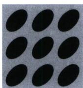
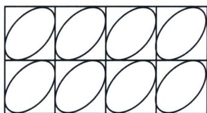
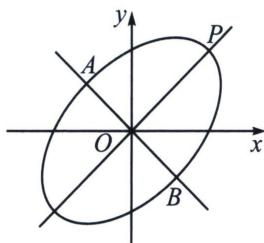

<!-- question-source:start -->
例2 (2025·多选·高三专题练习)椭圆与正方形是常见的几何图形, 具有对称美感, 受到设计师的青睐. 现有一工艺品, 其图案如图所示: 基本图形由正方形和内嵌其中的“斜椭圆”组成(“斜椭圆”和正方形的四边各恰有一个公共点). 在平面直角坐标系 $xOy$ 中, 将标准椭圆绕着对称中心旋转一定角度, 即得“斜椭圆” $C: x^{2}+y^{2}-xy=3$ , 点 $P$ 是斜椭圆 $C$ 上的点, $AB$ 为过斜椭圆 $C$ 中心 $O$ 的弦, 且满足 $OP \perp AB$ , 其中 $O$ 为坐标原点, 则 ( )

A. 该斜椭圆 $C$ 的长轴长为 $\sqrt{6}$ B. 该斜椭圆 $C$ 的离心率为 $\frac{\sqrt{6}}{3}$ C. 当点 $(x_0, y_0)$ 在 $C$ 上时， $x_0 + y_0 \leqslant 2\sqrt{3}$ D. $(S_{\triangle PAB})_{\min} = \frac{9}{2}$
<!-- question-source:end -->

![[高中/总复习/专题/2026版高中《mst老唐说题》圆锥曲线专题（数学）/上册/第04章_小题新题型与多选的综合题方法篇/第二节_坐标旋转与曲线转换/一_向量旋转公式与图像转化/例题/answers/Q00048534A1.md]]
