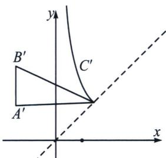

> [!faq]- 《圆锥曲线专题(上册)》例题解析
>
> > [!success]- **【答案】** A
>
> > [!note]- **【解析】**
> > 解析 解法一：设曲线上一点为 $(a, b)$ ，则 $a^2 - b^2 = 1$ ，则 $a = \sqrt{b^2 + 1}$ ， $k_{AB} = \frac{2 - 1}{1 - 0} = 1$ ， $AB$ 方程为： $y - 1 = x$ ，即 $x - y + 1 = 0$ ，根据点到直线的距离公式， $(a, b)$ 到 $AB$ 的距离为： $\frac{|a - b + 1|}{\sqrt{2}} = \frac{|\sqrt{b^2 + 1} - b + 1|}{\sqrt{2}} = \frac{\sqrt{b^2 + 1} - b + 1}{\sqrt{2}}$ ，设 $f(b) = \sqrt{b^2 + 1} - b = \frac{1}{\sqrt{b^2 + 1} + b}$ ，由于 $b \geqslant 0$ ，显然 $f(b)$ 关于 $b$ 单调递减， $f(b)_{max} = f(0)$ ，无最小值，即 $\triangle ABC$ 中， $AB$ 边上的高有最大值，无最小值，又 $AB$ 一定，故面积有最大值，无最小值.
> >
> > 解法二：作逆时针旋转 $45^{\circ}$ ，得 $\left\{ \begin{array}{l}x^{\prime} = \frac{\sqrt{2}}{2} (x - y)\\ y^{\prime} = \frac{\sqrt{2}}{2} (x + y) \end{array} \right.$ ，即 $y^\prime = \frac{1}{2x^\prime}\left(0 <   x'_c\leqslant \frac{\sqrt{2}}{2}\right)$ ，则 $A^{\prime}\left(-\frac{\sqrt{2}}{2},\frac{\sqrt{2}}{2}\right),$ $B^{\prime}\left(-\frac{\sqrt{2}}{2},\frac{3\sqrt{2}}{2}\right),$
> >
> > 
> >
> > 如图，故 $S_{\triangle ABC} = S_{\triangle A'B'C'} = \frac{\sqrt{2}}{2}\left|x_C' + \frac{\sqrt{2}}{2}\right| \in \left(\frac{\sqrt{2}}{2}, 1\right]$ ，
> >
> > 故选 **A**.
