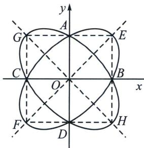

> [!faq]- 《圆锥曲线专题(上册)》例题解析
>
> > [!success]- **【答案】** A
>
> > [!note]- **【分析】**
> > 本题未单列分析。
>
> > [!note]- **【解析】**
> > 解析 设 $M(x_{2}, y_{2})$ 是 $x^{2} + y^{2} - xy = 1$ , $(xy \geqslant 0)$ 或 $x^{2} + y^{2} + xy = 1$ , $(xy \leqslant 0)$ 上任意一点, 则关于原点对称点为 $M'(-x_{2}, -y_{2})$ 代入方程 $x^{2} + y^{2} - xy = 1$ , $(xy \geqslant 0)$ 或 $x^{2} + y^{2} + xy = 1$ , $(xy \leqslant 0)$ , 方程式都不变, 所以 $x^{2} + y^{2} - xy = 1$ , $(xy \geqslant 0)$ 和 $x^{2} + y^{2} + xy = 1$ , $(xy \leqslant 0)$ 都关于原点对称, 设 $P(x, y)$ 是 $x^{2} + y^{2} - xy = 1$ , $(xy \geqslant 0)$ 或 $x^{2} + y^{2} + xy = 1$ , $(xy \leqslant 0)$ 上任意一点, 则关于直线 $y = x$ 对称点为 $P'(y, x)$ 代入方程 $x^{2} + y^{2} - xy = 1$ , $(xy \geqslant 0)$ 和 $x^{2} + y^{2} + xy = 1$ , $(xy \leqslant 0)$ , 方程式都不变, 则直线 $y = x$ 是 $x^{2} + y^{2} - xy = 1$ , $(xy \geqslant 0)$ 或 $x^{2} + y^{2} + xy = 1$ , $(xy \leqslant 0)$ 的对称轴, 设点 $(x, y)$ 是 $x^{2} + y^{2} - xy = 1$ , $(xy \geqslant 0)$ 或 $x^{2} + y^{2} + xy = 1$ , $(xy \leqslant 0)$ 任一点, 则关于 $y = -x$ 对称点为 $(-y, -x)$ 代入方程 $x^{2} + y^{2} - xy = 1$ , $(xy \geqslant 0)$ 和 $x^{2} + y^{2} + xy = 1$ , $(xy \leqslant 0)$ , 方程式都不变, 则直线 $y = -x$ 是 $x^{2} + y^{2} - xy = 1$ , $(xy \geqslant 0)$ 和 $x^{2} + y^{2} + xy = 1$ , $(xy \leqslant 0)$ 的对称轴, 由 $\left\{ \begin{array}{l} x^{2} + y^{2} - xy = 1 \\ y = x \end{array} \right.$ , 得 $\left\{ \begin{array}{l} x = 1 \\ y = 1 \end{array} \right.$ 或 $\left\{ \begin{array}{l} x = -1 \\ y = -1 \end{array} \right.$ , 即 $E(1, 1)$ , $F(-1, -1)$ , $E(1, 1)$ , $F(-1, -1)$ 即椭圆 $x^{2} + y^{2} - xy = 1$ 的两个顶点, 由 $\left\{ \begin{array}{l} x^{2} + y^{2} + xy = 1 \\ y = -x \end{array} \right.$ , 解得 $\left\{ \begin{array}{l} x = 1 \\ y = -1 \end{array} \right.$ 或 $\left\{ \begin{array}{l} x = -1 \\ y = 1 \end{array} \right.$ , 即 $G(-1, 1)$ , $H(1, -1)$ , $G(-1, 1)$ , $H(1, -1)$ 即椭圆 $x^{2} + y^{2} + xy = 1$ 的两个顶点, 则 $x^{2} + y^{2} - xy = 1$ , $(xy \geqslant 0)$ 表示椭圆 $x^{2} + y^{2} - xy = 1$ 除去第二, 四象限部分; $x^{2} + y^{2} + xy = 1$ , $(xy \leqslant 0)$ 表示椭圆 $x^{2} + y^{2} + xy = 1$ 除去第一, 三象限部分;
> > 
> > 又 d 是 M 中两点间的距离的最大值，所以椭圆上两点间的距离最大值为长轴长，
> > 即 $d = |GH| = |EF| = \sqrt{(-1 - 1)^2 + (1 + 1)^2} = 2\sqrt{2}$ ，又四边形 $GEHF$ 的面积为 $S_{GEHF} = |GE|\cdot |EH| = 2\times 2 = 4$ ，所以 $S > 4$ ，
> >
> > 故选 **A**.
