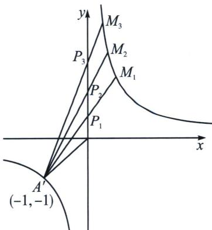

> [!faq]- 《圆锥曲线专题(上册)》例题解析
>
> > [!success]- **【答案】** B
>
> > [!note]- **【分析】**
> > 本题未单列分析。
>
> > [!note]- **【解析】**
> > 解析 解法一：双曲线的一条渐近线 $y = 2x$ ，所以 $b = 2$ ，即 $C: x^2 - \frac{y^2}{4} = 1$ ， $A(-1, 0)$ ，点 $P$ 在渐近线 $y = 2x$ 上，设 $P(t, 2t), t \neq 0, l_{AP}: y = \frac{2t}{t + 1}(x + 1)$ ，联立曲线方程得 $(2t + 1)x^2 - 2t^2x - 2t^2 - 2t - 1 = (2t + 1)(x + 1)\left(x - \frac{2t^2 + 2t + 1}{2t + 1}\right) = 0$ ，可得 $M\left(\frac{2t^2 + 2t + 1}{2t + 1}, \frac{4t^2 + 4t}{2t + 1}\right)$ ，因为 $M$ 在右支，所以 $\frac{2t^2 + 2t + 1}{2t + 1} = \frac{2\left(t + \frac{1}{2}\right)^2 + \frac{1}{2}}{2t + 1} > 0$ ，解得 $2t + 1 > 0, S_{\triangle OAP} = \frac{1}{2}|OP||y_p| = |t|$ ， $S_{\triangle OAM} = \frac{1}{2}|OP||y_M| = \left|\frac{2t^2 + 2t}{2t + 1}\right|$ ，则 $S_{\triangle OPM} = S_{\triangle OAM} - S_{\triangle OAP} = \left|\frac{t}{2t + 1}\right|$ ， $S(P) = \frac{S_{\triangle OAP}}{S_{\triangle OPM}} = |2t + 1| = 2t + 1$ ，设 $P_1(t_1, 2t_1), P_2(t_2, 2t_2), P_3(t_3, 2t_3)$ ，因为 $P_2$ 为 $P_1P_3$ 中点，所以 $t_1 + t_3 = 2t_2, S(P_1) + S(P_3) = 2t_1 + 1 + 2t_3 + 1 = 2(t_1 + t_3) + 2 = 4t_2 + 2 = 2S(P_2)$ ，
> > 
> > 解法二: 由于 $C: x^{2} - \frac{y^{2}}{b^{2}} = 1$ 渐近线为 $y = 2x$ , 故 $b = 2$ , 本题涉及面积比, 双曲线跟渐近线相关的作出仿射旋转成反比例函数, 构造 $\left\{ \begin{array}{l} x' = x - \frac{y}{2} \\ y' = x + \frac{y}{2} \end{array} \right.$ , 所以 $y' = \frac{1}{2}$ , 则 $A'(-1, -1)$ , 渐近线变为 $y$ 轴, 如图所示, $S(P) = \frac{S_{\triangle OAP}}{S_{\triangle OPM}} = \frac{S_{\triangle OA'P'}}{S_{\triangle OP'M'}} = \frac{-x_A'}{x_M'} = \frac{1}{x_M'}$ , $A'M_i: y - y_A' = \frac{y_{M_i} - y_A'}{x_{M_i} - x_A'} (x - x_A')$ , 即 $-x_{M_i}y + x = -1 + x_{M_i}$ , 当 $x = 0$ 时, $y_{P_i} = \frac{1 - x_{M_i}}{x_{M_i}}$ , 由于 $P_2$ 为 $P_1P_3$ 中点, 所以 $\frac{1 - x_{M_1}}{x_{M_1}} + \frac{1 - x_{M_3}}{x_{M_3}} = 2\frac{1 - x_{M_2}}{x_{M_2}}$ , 即 $\frac{1}{x_{M_1}} + \frac{1}{x_{M_3}} = \frac{2}{x_{M_2}}$ , 所以 $S(P_1) + S(P_3) = 2S(P_2)$ ,
> >
> > 故选 **B**. 故选 **B**.
