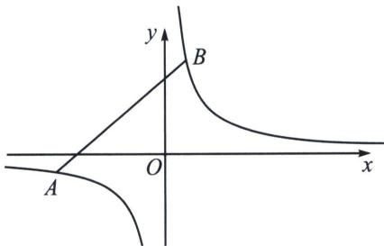

## 二、等轴双曲线与反比例函数转化

如图， $A(x_{1}, y_{1})$ 和 $B(x_{2}, y_{2})$ 分别是反比例函数（等轴双曲线） $y=\frac{m}{x}$ 上的两点，则 AB 的两点对合式方程为： $\frac{x_{1}x_{2}}{m}y+x=x_{1}+x_{2}$ .

证明：由于 $k_{AB} = \frac{\frac{m}{x_1} - \frac{m}{x_2}}{x_1 - x_2} = -\frac{m}{x_1x_2}$ ，故 $AB: y - \frac{m}{x_1} = -\frac{m}{x_1x_2}(x - x_1)$ ，即 $\frac{x_1x_2}{m} y + x = x_1 + x_2$

![[高中/总复习/专题/2026版高中《mst老唐说题》圆锥曲线专题（数学）/上册/第04章_小题新题型与多选的综合题方法篇/第二节_坐标旋转与曲线转换/二_等轴双曲线与反比例函数转化/例题/Q00048538.md]]
![[高中/总复习/专题/2026版高中《mst老唐说题》圆锥曲线专题（数学）/上册/第04章_小题新题型与多选的综合题方法篇/第二节_坐标旋转与曲线转换/二_等轴双曲线与反比例函数转化/例题/Q00048539.md]]
