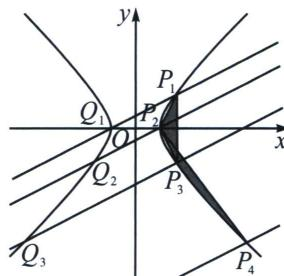
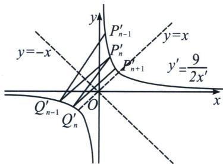
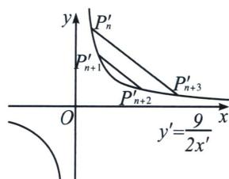

> [!faq]- 《圆锥曲线专题(上册)》例题解析
>
> > [!success]- **【答案】** BC
>
> > [!note]- **【解析】**
> > 解析 由已知有 $m = 5^{2} - 4^{2} = 9$ ，故 $\Gamma$ 的方程为 $x^{2} - y^{2} = 9$ ，当 $k = \frac{1}{2}$ 时，过 $P_{1}(5,4)$ 且斜率为 $\frac{1}{2}$ 的直线为 $y = \frac{x + 3}{2}$ ，与 $x^{2} - y^{2} = 9$ 联立得到 $x^{2} - \left(\frac{x + 3}{2}\right)^{2} = 9$ ，解得 $x = -3$ 或 5，所以该直线与 $\Gamma$ 的不同于 $P_{1}$ 的交点为 $Q_{1}(3,0)$ ，该点显然在 $\Gamma$ 的左支上，故 $x_{2} = 3$ ，故 A 错误；B 正确；
> >
> > 
> >
> > 解法一：因为 $P_{n}(x_{n},y_{n})$ ， $Q_{n}(-x_{n + 1},y_{n + 1})$ ， $k = -\frac{y_{n + 1} - y_n}{x_{n + 1} + x_n}$ ，则 $\frac{1 + k}{1 - k} = \frac{x_{n + 1} + x_n - y_{n + 1} + y_n}{x_{n + 1} + x_n + y_{n + 1} - y_n}$
> >
> > 由 $\left\{\begin{aligned}x_{n+1}^{2}-y_{n+1}^{2}&=9\\ x_{n}^{2}-y_{n}^{2}&=9\end{aligned}\right.$ ，作差得 $(x_{n+1}-y_{n+1})(x_{n+1}+y_{n+1})=(x_{n}-y_{n})(x_{n}+y_{n})$ ，
> >
> > $\frac{x_{n+1}-y_{n+1}}{x_{n}-y_{n}}=\frac{x_{n}+y_{n}}{x_{n+1}+y_{n+1}}$ ，利用合比性质知 $\frac{x_{n+1}-y_{n+1}}{x_{n}-y_{n}}=\frac{x_{n}+y_{n}}{x_{n+1}+y_{n+1}}=\frac{x_{n+1}-y_{n+1}+x_{n}+y_{n}}{x_{n}-y_{n}+x_{n+1}+y_{n+1}}=\frac{1+k}{1-k}$
> >
> > 因此 $\{x_{n} - y_{n}\}$ 是公比为 $\frac{1 + k}{1 - k}$ 的等比数列，故C正确；
> >
> > 由 $\left\{\begin{aligned}x_{n+1}^{2}-y_{n+1}^{2}&=9\\ x_{n}^{2}-y_{n}^{2}&=9\end{aligned}\right.$ ，作差得 $(x_{n+1}-x_{n})(x_{n+1}+x_{n})=(y_{n+1}-y_{n})(y_{n+1}+y_{n})$ ，
> >
> > 变形得 $k_{P_nP_{n + 1}} = \frac{y_{n + 1} - y_n}{x_{n + 1} - x_n} = \frac{x_{n + 1} + x_n}{y_{n + 1} + y_n} = \frac{y_{n + 1} - y_n + x_{n + 1} + x_n}{x_{n + 1} - x_n + y_{n + 1} + y_n}$ ①，
> >
> > 同理可得 $k_{P_{n - 1}P_{n + 2}} = \frac{y_{n + 2} - y_{n - 1}}{x_{n + 2} - x_{n - 1}} = \frac{x_{n + 2} + x_{n - 1}}{y_{n + 2} + y_{n - 1}} = \frac{y_{n + 2} - y_{n - 1} + x_{n + 2} + x_{n - 1}}{x_{n + 2} - x_{n - 1} + y_{n + 2} + y_{n - 1}},$
> >
> > 可知 $\{x_{n} - y_{n}\}$ 是公比为 $\frac{1 + k}{1 - k}$ 的等比数列，令 $q = \frac{1 + k}{1 - k}$ 则 $x_{n} - y_{n} = q(x_{n - 1} - y_{n - 1})$ ②，
> >
> > 同时 $\{x_{n} + y_{n}\}$ 是公比为 $\frac{1}{q}$ 的等比数列，则 $x_{n + 1} + y_{n + 1} = q(x_{n + 2} + y_{n + 2})$ ③，
> >
> > 将②③代入①， $\frac{y_{n+1}-y_{n}}{x_{n+1}-x_{n}}=\frac{x_{n+1}+y_{n+1}+x_{n}-y_{n}}{x_{n+1}+y_{n+1}-(x_{n}-y_{n})}=\frac{q(x_{n+2}+y_{n+2})+q(x_{n-1}-y_{n-1})}{q(x_{n+2}+y_{n+2})-q(x_{n-1}-y_{n-1})}=\frac{x_{n+2}+y_{n+2}+x_{n-1}-y_{n-1}}{x_{n+2}+y_{n+2}-(x_{n-1}-y_{n-1})}$ ，即 $k_{P_{n}P_{n+1}}=k_{P_{n-1}P_{n+2}}$ ，从而 $S_{n-1}=S_{n}$ ，即 $S_{n}=S_{n+1}$ ，故D错误.
> >
> > 
> >
> > 
> >
> > 解法二：将等轴双曲线 $x^{2} - y^{2} = 9$ 逆时针旋转 $\frac{\pi}{4}$ ，记原双曲线上任意一点 $P_{n}: (x_{n}, y_{n})$ 故 $\left\{ \begin{array}{l} x_{n}^{\prime} = \frac{\sqrt{2}}{2} (x_{n} - y_{n}) \\ y_{n}^{\prime} = \frac{\sqrt{2}}{2} (x_{n} + y_{n}) \end{array} \right.$ ，由于 $x_{n}^{2} - y_{n}^{2} = 9$ ，故 $x_{n}^{\prime}y_{n}^{\prime} = \frac{1}{2} (x_{n}^{2} - y_{n}^{2}) = \frac{9}{2}$ ，本题仅需证 $\frac{x_{n}^{\prime}}{x_{n-1}^{\prime}}$ 为定值，由于 $Q_{n-1}$ 与 $P_{n}$ 关于 $y$ 轴对称，故 $Q_{n-1}^{\prime}$ 与 $P_{n}^{\prime}$ 关于 $y = -x$ 对称，且新坐标系 $k' = \frac{1 + k}{1 - k} (0 < k < 1)$ ，记 $P_{n-1}^{\prime}(x_{n-1}^{\prime}, y_{n-1}^{\prime})$ ， $P_{n}^{\prime}(x_{n}^{\prime}, y_{n}^{\prime})$ ，则 $Q_{n-1}^{\prime}(-y_{n}^{\prime}, -x_{n}^{\prime})$ ， $k^{\prime} = k_{P_{n-1}^{\prime}Q_{n-1}^{\prime}} = \frac{\frac{9}{2x_{n-1}^{\prime}} + \frac{9}{2y_{n}^{\prime}}}{x_{n-1}^{\prime} + y_{n}^{\prime}} = \frac{9}{2x_{n-1}^{\prime}y_{n}^{\prime}} = \frac{x_{n}^{\prime}}{x_{n-1}^{\prime}}$ ，故 $\frac{x_n - y_n}{x_{n-1} - y_{n-1}} = \frac{1 + k}{1 - k}$ ，C 正确；
> >
> > 根据旋转后平行性质不变，故需要证明 $P_{n}^{\prime}P_{n + 3}^{\prime} / / P_{n + 1}^{\prime}P_{n + 2}^{\prime}$ ， $P_{i}^{\prime}\left(x_{i},\frac{9}{2x_{i}}\right),P_{j}^{\prime}\left(x_{j},\frac{9}{2x_{j}}\right)$ ， $k^{\prime} = k_{P_{i}^{\prime}P_{j}^{\prime}}$ $= -\frac{9}{2x_{i}^{\prime}x_{j}^{\prime}}$ ，反比例函数任意两点的对合式方程为： $\frac{2x_i x_j}{9} y + x = x_i + x_j$ ，所以 $k_{P_n^{\prime}P_{n + 3}^{\prime}} = -\frac{9}{2x_{n + 3}^{\prime}x_{n}^{\prime}}$ $k_{P_{n + 1}^{\prime}P_{n + 2}^{\prime}} = -\frac{9}{2x_{n + 2}^{\prime}x_{n + 1}^{\prime}}$ ，由于 $\{x_n^\prime \}$ 是等比数列，故 $x_{n}^{\prime}x_{n + 3}^{\prime} = x_{n + 1}^{\prime}x_{n + 2}^{\prime}$ ，故 $k_{P_n^{\prime}P_{n + 3}^{\prime}} = k_{P_{n + 1}^{\prime}P_{n + 2}^{\prime}}$ ，D错误；
> >
> > 故选 **BC**.
