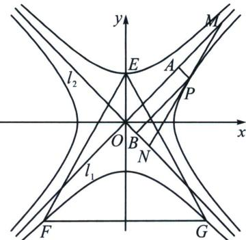
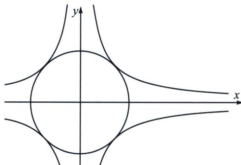
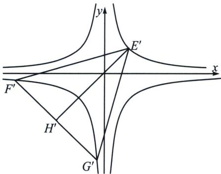

> [!faq]- 《圆锥曲线专题(上册)》例题解析
>
> > [!success]- **【答案】** BCD
>
> > [!note]- **【解析】**
> > 解析 解法一：易知 $l_{1} \perp l_{2}$ ，又因为 $PA \perp OA$ ， $PB \perp OB$ ，则 OAPB 为矩形，设点 $P(x, y)$ ，则 $|PA| = \frac{|x - y|}{\sqrt{2}}$ ， $|PB| = \frac{|x + y|}{\sqrt{2}}$ ，矩形 OAPB 的面积 $S = |PA| \cdot |PB| = \frac{|x^{2} - y^{2}|}{2} = 1$ ，可得 $|x^{2} - y^{2}| = 2$ ，故曲线 C 的方程为 $|x^{2} - y^{2}| = 2$ ，
> >
> > 对于 A 选项，联立 $\left\{\begin{aligned}|x^{2}-y^{2}|&=2\\ x^{2}+y^{2}&=2\end{aligned}\right.$ 可得 $\left\{\begin{aligned}x&=\pm\sqrt{2}\\ y&=0\end{aligned}\right.$ 或 $\left\{\begin{aligned}x&=0\\ y&=\pm\sqrt{2}\end{aligned}\right.$ ，所以，曲线 C 与圆 O 有 4 个公共点，其坐标分别为 $(\sqrt{2},0)$ 、 $(-\sqrt{2},0)$ 、 $(0,\sqrt{2})$ 、 $(0,-\sqrt{2})$ ，A 错；
> >
> > 对于 B 选项，联立 $\left\{\begin{aligned} y &= x + \frac{1}{x} \\ |x^{2} - y^{2}| &= 2 \end{aligned}\right.$ 可得 $\left|2 + \frac{1}{x^{2}}\right| = 2$ ，该方程无解，所以，曲线 $y = x + \frac{1}{x}$ 与 C 没有公共点，B 对；
> >
> > 对于C选项，不妨取点 $E(0, \sqrt{2})$ ，取直线 $EF$ 的方程为 $y = \sqrt{3} x + \sqrt{2}$ ，取直线 $EG$ 的方程为 $y = -\sqrt{3} x + \sqrt{2}$ ，联立 $\left\{ \begin{array}{l} y = \sqrt{3} x + \sqrt{2} \\ y^2 - x^2 = 2 \\ x \neq 0 \end{array} \right.$ ，解得 $\left\{ \begin{array}{l} x = -\sqrt{6} \\ y = -2\sqrt{2} \end{array} \right.$ ，即点 $F(-\sqrt{6}, -2\sqrt{2})$ ，联立 $\left\{ \begin{array}{l} y = -\sqrt{3} x + \sqrt{2} \\ y^2 - x^2 = 2 \\ x \neq 0 \end{array} \right.$ ，解得 $\left\{ \begin{array}{l} x = \sqrt{6} \\ y = -2\sqrt{2} \end{array} \right.$ ，即点 $G(\sqrt{6}, -2\sqrt{2})$ ， $|EF| = \sqrt{(-\sqrt{6} - 0) + (-2\sqrt{2} - \sqrt{2})^2} = 2\sqrt{6}$ ，
> >
> > 
> >
> > 同理可得 $\left|EG\right|=\left|FG\right|=2\sqrt{6}$ ，此时， $\triangle EFG$ 为等边三角形，C 对；
> >
> > 对于D选项，设 $P(x_0, y_0)$ 为双曲线 $x^2 - y^2 = 2$ 上一点，双曲线 $x^2 - y^2 = 2$ 在点 $P$ 处的切线方程为 $x_0x - y_0y = 2$ ，易知，直线 $l_1, l_2$ 的方程可视为 $x^2 - y^2 = 0$ ，设点 $M(x_1, y_1), N(x_2, y_2)$ ，联立 $\left\{ \begin{array}{l} x_0x - y_0y = 2 \\ x^2 - y^2 = 0 \end{array} \right.$ 可得 $x^2 - 2x_0x + 2 = 0$ ，由韦达定理可得 $x_1x_2 = 2$ ，所以， $S_{\triangle OMN} = \frac{1}{2} |OM| \cdot |ON| = \frac{1}{2} \times \sqrt{2}|x_1| \times \sqrt{2}|x_2| = |x_1x_2| = 2$ ，因为点 $P$ 关于直线 $y = x$ 的对称点为 $Q(y_0, x_0)$ ，则 $|y_0^2 - x_0^2| = |x_0^2 - y_0^2| = 2$ ，所以，曲线 $C$ 关于直线 $y = x$ 对称，由对称性可知，当点 $P$ 在曲线 $y^2 - x^2 = 2$ 上时， $\triangle OMN$ 的面积也为定值 2，D 对.
> >
> > 解法二：利用反比例函数 $|xy| = k = S_{OAPB} = 1$ ，所以旋转 $45^{\circ}$ 后得反比例函数为 $y = \pm \frac{1}{x}$ ，与圆 $O: x^{2} + y^{2} = 2$ 有四个交点 $(-1, -1)$ ， $(-1, 1)$ ， $(1, -1)$ ， $(1, 1)$ ，如图，故 A 错误；
> >
> > 
> >
> > 
> >
> > 对于 B， $y=x+\frac{1}{x}$ ，令 $\left\{\begin{aligned}x&=\frac{\sqrt{2}}{2}(x'+y')\\ y&=\frac{\sqrt{2}}{2}(y'-x')\end{aligned}\right.$ ，所以 $y'=-\left(x'+\frac{1}{x'}\right)$ ，与 $y'=\pm\frac{1}{x}$ 没有交点，B 正确；
> >
> > 对于 C，取 $E'(1,1)$ ，则 $H'(-m,-m)$ ，所以 $F'G'$ ： $x_{1}x_{2}y+x=x_{1}+x_{2}$ ，由于 $k=-\frac{1}{x_{1}x_{2}}=-1$ ，所以 $x+y=-2m$ ，所以 $x_{1}+x_{2}=-2m$ ， $|F'G'|=\sqrt{1+k^{2}}|x_{2}-x_{1}|=2\sqrt{2}\sqrt{m^{2}-1}$ ，仅需 $|E'H'|=\frac{\sqrt{3}}{2}|F'G'|$ $\Leftrightarrow\sqrt{2}(1+m)=\sqrt{6}\sqrt{m^{2}-1}$ ，所以 m=2 或 m=-1，C 正确；
> >
> > D 正确，属于渐切三角形，面积为定值 2(参考本讲后面内容)；
> >
> > 故选 **BCD**.
