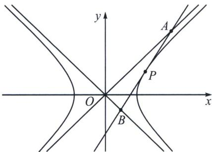
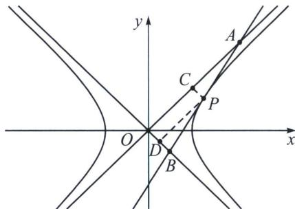

## 五、渐近切线三角形面积与向量积问题

定理：过双曲线 $\frac{x^{2}}{a^{2}}-\frac{y^{2}}{b^{2}}=1(a>0,b>0)$ 上一点 $P(x_{0},y_{0})$ ，作双曲线的切线交两渐近线于 $A(x_{1},y_{1})$ 、 $B(x_{2},y_{2})$ 两点，则称△AOB为双曲线的切线渐近三角形，双曲线的切线渐近三角形有如下性质：

(1) 点 P 处的切线方程为 $\frac{x_{0}x}{a^{2}} - \frac{y_{0}y}{b^{2}} = 1$ ，即 $k_{OP} \cdot k_{AB} = \frac{b^{2}}{a^{2}} = e^{2} - 1$ .

(2)点 P 是线段 AB 的中点，即 $\left|PA\right|=\left|PB\right|$ .

(3)①渐近三角形的面积为定值，即 $S_{\triangle AOB}=ab$ ; ② $\overrightarrow{OA}\cdot\overrightarrow{OB}=a^{2}-b^{2}$ ， $|OA|\cdot|OB|=a^{2}+b^{2}$ ;

证明：(1)和(2)都可以按照中点弦的极限原理理解，比较好记忆，关于(3)我们仅仅需要过 P 作两渐近线的平行线交于 C、D 两点，易知 $S_{AOB}=2S_{CCPD}=ab$ ，同理 $\overrightarrow{OA}\cdot\overrightarrow{OB}=2\overrightarrow{OC}\cdot\overrightarrow{2OD}=a^{2}-b^{2}$ ， $|OA|\cdot|OB|=2|OC|\cdot2|OD|=a^{2}+b^{2}$ ;

![[高中/总复习/专题/2026版高中《mst老唐说题》圆锥曲线专题（数学）/上册/第04章_小题新题型与多选的综合题方法篇/第二节_坐标旋转与曲线转换/五_渐近切线三角形面积与向量积问题/例题/Q00048546.md]]
![[高中/总复习/专题/2026版高中《mst老唐说题》圆锥曲线专题（数学）/上册/第04章_小题新题型与多选的综合题方法篇/第二节_坐标旋转与曲线转换/五_渐近切线三角形面积与向量积问题/例题/Q00048547.md]]
![[高中/总复习/专题/2026版高中《mst老唐说题》圆锥曲线专题（数学）/上册/第04章_小题新题型与多选的综合题方法篇/第二节_坐标旋转与曲线转换/五_渐近切线三角形面积与向量积问题/例题/Q00048548.md]]
