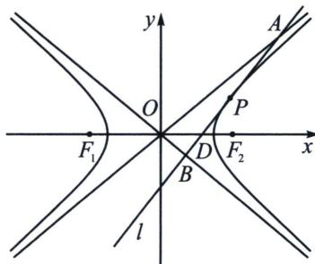

<!-- question-source:start -->
例15 (2024·多选·杭州期末)如图, 过曲线 $C: x^{2} - \frac{y^{2}}{b^{2}} = 1 (b > 0)$ 右支上一点 $P$ 作双曲线的切线 $l$ 分别交两渐近线于 $A 、 B$ 两点, 交 $x$ 轴于点 $D, F_{1}, F_{2}$ 分别为双曲线的左、右焦点, $O$ 为坐标原点, 则下列结论正确的是

A. $|AB|_{\min}=2\sqrt{b^{2}+1}$

B. $S_{\triangle OAP}=S_{\triangle OBP}$

C. $S_{\triangle AOB} = b$

D. 若存在点 $P$ ，使 $\cos \angle F_{1}PF_{2} = \frac{1}{4}$ ，且 $\overrightarrow{F_1D} = 2\overrightarrow{DF_2}$ ，则双曲线 $C$ 的离心率 $e = 2$
<!-- question-source:end -->

![[高中/总复习/专题/2026版高中《mst老唐说题》圆锥曲线专题（数学）/上册/第04章_小题新题型与多选的综合题方法篇/第二节_坐标旋转与曲线转换/五_渐近切线三角形面积与向量积问题/例题/answers/Q00048547A1.md]]
