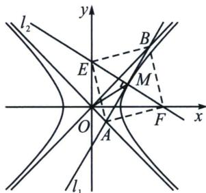

> [!faq]- 《圆锥曲线专题(上册)》例题解析
>
> > [!success]- **【答案】** BCD
>
> > [!note]- **【解析】**
> > 解析 对于 A，如图，设 $M(x_{0}, y_{0})(x_{0}>0)$ ，OM 中点为 $G(x, y)$ ，则 $x=\frac{x_{0}}{2}$ ， $y=\frac{y_{0}}{2}$ 。因为 $x_{0}^{2}-y_{0}^{2}=2$ ，所以 $x^{2}-y^{2}=\frac{1}{2}(x>0)$ ，故 A 错误。
> >
> > 
> >
> > 对于 B，易知 $OA \perp OB$ ，双曲线 C 的渐近线为 $y = \pm x$ 。因为直线 $l_{1}$ 过点 M 且与双曲线相切，所以设直线 $l_{1}$ 的方程为 $xx_{0} - yy_{0} = 2$ 。联立 $\left\{\begin{aligned} &xx_{0}-yy_{0}=2, \\ &y=x,\end{aligned}\right.$ 得 $x_{B}=\frac{2}{x_{0}-y_{0}}$ ，联立 $\left\{\begin{aligned} &xx_{0}-yy_{0}=2, \\ &y=-x,\end{aligned}\right.$ 得 $x_{A}=\frac{2}{x_{0}+y_{0}}$ 。
> >
> > 所以 $S_{\mathrm{Rt}\triangle OAB} = \frac{1}{2}|OA|\cdot |OB| = \frac{1}{2}\cdot \sqrt{2}|x_A|\cdot \sqrt{2}|x_B| = \frac{4}{x_0^2 - y_0^2} = 2$ ，本选项也是渐切三角形面积为定值，故B正确.
> >
> > 对于C，因为 $x_{M} - x_{A} = x_{M} - \frac{2}{x_{0} + y_{0}} = x_{0} - \frac{2}{x_{0} + y_{0}} = x_{0} - (x_{0} - y_{0}) = y_{0}$
> >
> > 且 $x_{B} - x_{M} = \frac{2}{x_{0} - y_{0}} -x_{M} = \frac{2}{x_{0} - y_{0}} -x_{0} = x_{0} + y_{0} - x_{0} = y_{0}$ ，所以 $\vert MA\vert = \vert MB\vert$ ，故C正确.
> >
> > 对于 D，顺次连接 E，B，F，A 四点，因为直线 $l_{1}$ ： $xx_{0}-yy_{0}=2$ ，所以 $k_{1}=\frac{x_{0}}{y_{0}}$ 。又直线 $l_{2}$ 与直线 $l_{1}$ 垂直，所以 $k_{2}=\frac{-1}{k_{1}}=-\frac{y_{0}}{x_{0}}$ ，所以直线 $l_{2}$ ： $y=-\frac{y_{0}}{x_{0}}(x-x_{0})+y_{0}$ ，即 $y=-\frac{y_{0}}{x_{0}}x+2y_{0}$ ，得到 $E(0,2y_{0})$ ， $F(2x_{0},0)$ ，所以 M 是 EF 的中点。又 $|MA|=|MB|$ ，所以 EF，AB 相互平分。在 Rt△OAB 中，AB=2OM，在 Rt△OEF 中，EF=2OM，所以 AB=EF。又 AB⊥EF，所以四边形 EBFA 为正方形，故 D 正确。
> >
> > 故选 **BCD**。
