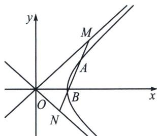

<!-- question-source:start -->
例12 (2025·多选·吉林长春模拟预测)已知双曲线 $\Gamma: x^{2} - y^{2} = 1$ , 直线 $m$ 与双曲线 $\Gamma$ 的右支交于点 $A, B(A$ 在 $x$ 轴上方), 与双曲线的两条渐近线交于点 $M, N(M$ 在 $x$ 轴上方), $O$ 为坐标原点. 当直线 $m$ 的斜率存在时, 下列结论中正确的是 ( )
A. $|BM| = |AN|$ 恒成立
B. $\triangle MON$ 的面积的最小值为 1
C. 若 $S_{\triangle MON} = 3S_{\triangle AOB}$ , 则 $|MA| = |AB| = |BN|$ D. 若 $|MA| = |AB| = |BN|$ , 则 $\triangle MON$ 的面积为定值

$$
m: y = k x + b
$$

$$
x ^ {2} - y ^ {2} = 1
$$

$$
(1 - k ^ {2}) x ^ {2} - 2 b k x - b ^ {2} - 1 = 0
$$

设 $A(x_{1},y_{1})$ ， $B(x_{2},y_{2})$ ，则 $x_{1}$ ， $x_{2}$ 是方程①的两个根，有 $x_{1} + x_{2} = \frac{2kb}{1 - k^{2}}$ ， $x_{1}x_{2} = \frac{-(b^{2} + 1)}{1 - k^{2}}$ 设 $M(x_{3},y_{3}),N(x_{4},y_{4})$ ，由 $\left\{ \begin{array}{l}y = kx + b\\ x^2 -y^2 = 0 \end{array} \right.$ ，所以 $x_{3} + x_{4} = \frac{2kb}{1 - k^{2}}$ ，所以MN和AB的中点重合，所以 $|MA| = |BN|$ ，所以 $|BM| = |AN|$ 恒成立．故A正确.

对于 B，当 MN 过点 $(1, 0)$ 且 MN 垂直于 x 轴时， $\triangle MON$ 的面积最小值为 1，由于 AB 斜率存在，故使得 $\triangle MON$ 的面积大于 1，故 B 错误.

对于 C，因为 MN 和 AB 的中点重合为 P，所以 $\left|MA\right|=\left|BN\right|$ ，又 $3S_{\triangle AOB}=S_{\triangle MON}$ ，所以 $3\left|AB\right|=\left|M N\right|$ ，所以 $\left|MA\right|=\left|AB\right|=\left|BN\right|$ ，故 C 正确.

对于 D，因为 $\left|MA\right|=\left|AB\right|=\left|BN\right|$ ，所以 $\left|AB\right|=\frac{1}{3}\left|M N\right|$ ，得 $\sqrt{1+k^{2}}\left|x_{1}-x_{2}\right|=\frac{1}{3}\sqrt{1+k^{2}}\left|x_{3}-x_{4}\right|$ ，即 $b^{2}=\frac{9}{8}(k^{2}-1)>0$ ，所以 $k^{2}>1$ ，又 $\left|OM\right|=\sqrt{2}\left|\frac{b}{1-k}\right|$ ， $\left|ON\right|=\sqrt{2}\left|\frac{b}{1+k}\right|$ ， $\angle MON=90^{\circ}$ ，
所以 $S_{\triangle MON}=\frac{1}{2}|OM||ON|=\left|\frac{b^{2}}{1-k^{2}}\right|=\frac{9}{8}$ 是定值。故 D 正确。故选 ACD。
<!-- question-source:end -->
