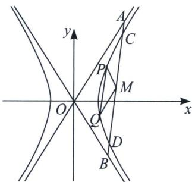
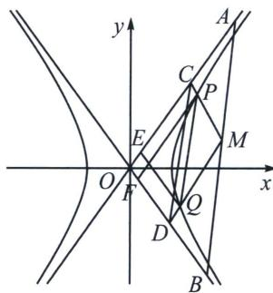

<!-- question-source:start -->
例13（2022 新高考Ⅱ卷）设双曲线 $C: \frac{x^2}{a^2} - \frac{y^2}{b^2} = 1 (a > 0, b > 0)$ 右焦点为 $F(2, 0)$ ，渐近线方程为 $y = \pm \sqrt{3} x$ ，

(1)求 $C$ 的方程

(2)过 F 的直线与 C 的两条渐近线分别交于 A, B 两点，点 $P(x_{1}, y_{1})$ ， $Q(x_{2}, y_{2})$ 在 C 上，且 $x_{1} > x_{2} > 0$ ， $y_{1} > 0$ ，过 P 且斜率为 $-\sqrt{3}$ 的直线与过 Q 且斜率为 $\sqrt{3}$ 的直线交于点 M。请从下面①②③中选取两个作为条件，证明另一个条件成立：

①M 在 AB 上；②PQ//AB；③|MA|=|MB|.

## 解析
(1) $x^{2}-\frac{y^{2}}{3}=1$
<!-- question-source:end -->

![[高中/总复习/专题/2026版高中《mst老唐说题》圆锥曲线专题（数学）/上册/第04章_小题新题型与多选的综合题方法篇/第二节_坐标旋转与曲线转换/四_退化二次曲线中点点差法/例题/answers/Q00048545A1.md]]
