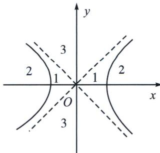
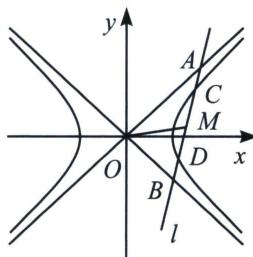

> [!faq]- 《圆锥曲线专题(上册)》例题解析
>
> > [!success]- **【答案】** B
>
> > [!note]- **【解析】**
> > 解析 如图，点 $P$ 位于区域1时， $0 < \frac{x_0^2}{a^2} - \frac{y_0^2}{b^2} < 1$ ， $\triangle < 0$ ，方程没有两实根；点 $P$ 位于区域2时， $\frac{x_0^2}{a^2} - \frac{y_0^2}{b^2} < 0$ ， $\triangle > 0$ ，方程有两不等实根；点 $P$ 位于区域1时， $\frac{x_0^2}{a^2} - \frac{y_0^2}{b^2} > 1$ ， $\triangle > 0$ ，方程有两不等实根。当点 $P$ 位于双曲线上与渐近线上，以 $P$ 为中点的弦不存在。
> >
> > 
> >
> > 因为双曲线不存在以点(2a, a)为中点的弦，所以 $0 \leqslant \frac{4a^{2}}{a^{2}} - \frac{a^{2}}{b^{2}} \leqslant 1$ ，故 $3 \leqslant \frac{a^{2}}{b^{2}} \leqslant 4$ ，即 $3b^{2} \leqslant a^{2} \leqslant 4b^{2}$ ，从而 $3(c^{2} - a^{2}) \leqslant a^{2} \leqslant 4(c^{2} - a^{2})$ ，得 $3c^{2} \leqslant 4a^{2}$ 且 $5a^{2} \leqslant 4c^{2}$ ，解得 $\frac{\sqrt{5}}{2} \leqslant e \leqslant \frac{2\sqrt{3}}{3}$ 。故选 B.
> >
> > ## 2. 双曲线弦与渐近线弦共中点类型
> >
> > 定理: 如左图, 作双曲线割线 $CD$ 并交渐近线于 $A$ , $B$ 两点, 则 $|AC| = |BD|$ . 我们也给出以下推论: 若 $M$ 是 $CD$ 中点, 则一定也是 $AB$ 中点, 反之亦然;
> >
> > 
> >
> > 证明：
> > 解法一：设直线为 $x=ty+m$ ，代入双曲线方程 $b^{2}x^{2}-a^{2}y^{2}=a^{2}b^{2}$ 得： $(b^{2}t^{2}-a^{2})y^{2}+2b^{2}tmy+b^{2}m^{2}-a^{2}b^{2}=0$ ，代入双曲线渐近线的退化二次曲线方程 $b^{2}x^{2}-a^{2}y^{2}=0$ 得： $(b^{2}t^{2}-a^{2})y^{2}+2b^{2}tmy+b^{2}m^{2}=0$ ，所以 AB 中点坐标和 CD 中点坐标重合，所以 $|AM|=|BM|$ ， $|CM|=|DM|$ 。
> >
> > 解法二：设 $M(x_{0}, y_{0})$ ，AB 与双曲线交于 $C(x_{3}, y_{3})$ 和 $D(x_{4}, y_{4})$ ， $A(x_{1}, y_{1})$ ， $B(x_{2}, y_{2})$ ，先进行双曲线中点等差法， $\left\{\begin{aligned}\frac{x_{3}^{2}}{a^{2}}-\frac{y_{3}^{2}}{b^{2}}=1\\ \frac{x_{4}^{2}}{a^{2}}-\frac{y_{4}^{2}}{b^{2}}=1\end{aligned}\right.$ ，两式相减可得： $\frac{y_{4}-y_{3}}{x_{4}-x_{3}}=\frac{b^{2}}{a^{2}}\frac{y_{4}+y_{3}}{x_{4}+x_{3}}$ ， $k_{OM}k_{CD}=\frac{b^{2}}{a^{2}}$ ，
> >
> > 再进行渐近线退化二次曲线点差， $\left\{ \begin{array}{l} \frac{x_1^2}{a^2} -\frac{y_1^2}{b^2} = 0\\ \frac{x_2^2}{a^2} -\frac{y_2^2}{b^2} = 0 \end{array} \right.$ ，两式相减可得： $\frac{(x_1 - x_2)(x_1 + x_2)}{a^2} -\frac{(y_1 - y_2)(y_1 + y_2)}{b^2}$ $= 0$ ，所以 $\frac{y_2 - y_1}{x_2 - x_1} = \frac{y_4 - y_3}{x_4 - x_3} = \frac{b^2}{a^2}\frac{y_2 + y_1}{x_2 + x_1} = \frac{b^2}{a^2}\frac{y_4 + y_3}{x_4 + x_3},k_{OM}k_{AB} = k_{OM}k_{CD} = \frac{b^2}{a^2}$ ，所以 $|AM| = |BM|$ $|CM| = |DM|$
