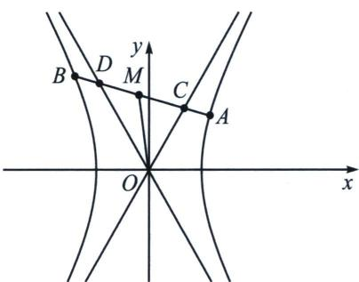
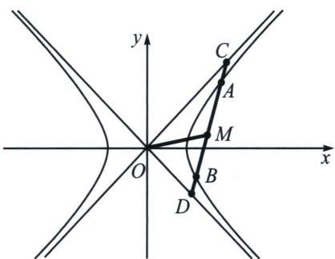
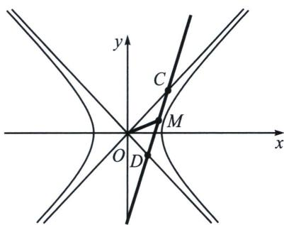

## 四、退化二次曲线中点点差法

1. 中点弦存在定理

①在椭圆 $\frac{x^{2}}{a^{2}}+\frac{y^{2}}{b^{2}}=1(a>b>0)$ 中，只需要AB中点 $M(x_{0},y_{0})$ 在椭圆内，即 $\frac{x_{0}^{2}}{a^{2}}+\frac{y_{0}^{2}}{b^{2}}<1$ ;

②在双曲线 $\frac{x^{2}}{a^{2}}-\frac{y^{2}}{b^{2}}=1(a>0,\ b>0)$ 中，一定有① $\left\{\begin{aligned}&|k_{OM}|>\frac{b}{a}\\ &|k_{AB}|<\frac{b}{a}\end{aligned}\right.$ 或 $\frac{x_{0}^{2}}{a^{2}}+\frac{y_{0}^{2}}{b^{2}}<0;$ ② $\left\{\begin{aligned}&|k_{OM}|<\frac{b}{a}\\ &\frac{x_{0}^{2}}{a^{2}}-\frac{y_{0}^{2}}{b^{2}}>1\end{aligned}\right.$

椭圆的中点弦存在定理很好理解，关于双曲线，这里存在一个共中点定理，就是弦 AB 与双曲线渐近线交于 CD 两点， $M(x_{0}, y_{0})$ 既是 AB 中点，又是 CD 中点，证明过程可以用直曲联立，也可以用点差法，我们本讲只介绍点差法，如下：

令 $C(x_{3}, y_{3})$ ， $D(x_{4}, y_{4})$ ，由于渐近线方程为 $y = \pm \frac{b}{a} x$ ，根据曲线与方程的思想，我们可以把两条渐近线上点的集合统一为方程 $(ay-bx)(ay+bx)=0$ ，即 $\frac{x^{2}}{a^{2}}-\frac{y^{2}}{b^{2}}=0$ ，此时CD一定满足 $\left\{\begin{aligned}\frac{x_{3}^{2}}{a^{2}}-\frac{y_{3}^{2}}{b^{2}}&=0\\ \frac{x_{4}^{2}}{a^{2}}-\frac{y_{4}^{2}}{b^{2}}&=0\end{aligned}\right.$ ，两式相减可得 $\frac{(x_{4}-x_{3})(x_{4}+x_{3})}{a^{2}}-\frac{(y_{4}-y_{3})(y_{4}+y_{3})}{b^{2}}=0,\quad k_{CD}=k_{AB}=\frac{b^{2}}{a^{2}}\cdot\frac{x_{3}+x_{4}}{y_{3}+y_{4}}=\frac{b^{2}}{a^{2}}\cdot\frac{x_{0}}{y_{0}}$ ，由于A、B、C、D四点共线，故 $M(x_{0},y_{0})$ 既是AB中点，又是CD中点.

所以双曲线的中点弦本质来自于渐近线，即 $OM$ 斜率绝对值大于渐近线斜率绝对值时， $AB$ 斜率一定小于渐近线斜率的绝对值，其实按照数字逻辑也很好理解，其实中点弦问题就可以转化为弦 $AB$ 与渐近线和双曲线均有两个交点，如果 $\left\{ \begin{array}{l} |k_{OM}| > \frac{b}{a} \\ |k_{AB}| < \frac{b}{a} \end{array} \right.$ （左图），或者 $\frac{x_0^2}{a^2} - \frac{y_0^2}{b^2} < 0$ 时，此时弦 $AB$ 与渐近线有两个交点，也与双曲线有两个交点，此时一定成立；当 $\left\{ \begin{array}{l} |k_{OM}| < \frac{b}{a} \\ \frac{x_0^2}{a^2} - \frac{y_0^2}{b^2} > 1 \end{array} \right.$ （中图），或者仅需 $\frac{x_0^2}{a^2} - \frac{y_0^2}{b^2} > 1$ 时，由于 $M(x_0, y_0)$ 在双曲线内部，此时弦 $AB$ 与渐近线有两个交点，也与双曲线有两个交点，此时一定成立；当 $\left\{ \begin{array}{l} |k_{OM}| \leqslant \frac{b}{a} \\ 0 \leqslant \frac{x_0^2}{a^2} - \frac{y_0^2}{b^2} < 1 \end{array} \right.$ 或者仅需 $0 \leqslant \frac{x_0^2}{a^2} - \frac{y_0^2}{b^2} < 1$ （右图）时，此时弦与渐近线有 $CD$ 两个交点，但与双曲线并没有两个交点，此时不存在这样的中点弦.

综上，双曲线的中点弦本质就是中点 $M(x_0, y_0)$ 的位置，当 $M$ 位于双曲线和渐近线中间的区域时，一定不存在以 $M$ 为中点的弦.

![[高中/总复习/专题/2026版高中《mst老唐说题》圆锥曲线专题（数学）/上册/第04章_小题新题型与多选的综合题方法篇/第二节_坐标旋转与曲线转换/四_退化二次曲线中点点差法/例题/Q00048542.md]]
![[高中/总复习/专题/2026版高中《mst老唐说题》圆锥曲线专题（数学）/上册/第04章_小题新题型与多选的综合题方法篇/第二节_坐标旋转与曲线转换/四_退化二次曲线中点点差法/例题/Q00048955.md]]
![[高中/总复习/专题/2026版高中《mst老唐说题》圆锥曲线专题（数学）/上册/第04章_小题新题型与多选的综合题方法篇/第二节_坐标旋转与曲线转换/四_退化二次曲线中点点差法/例题/Q00048956.md]]
![[高中/总复习/专题/2026版高中《mst老唐说题》圆锥曲线专题（数学）/上册/第04章_小题新题型与多选的综合题方法篇/第二节_坐标旋转与曲线转换/四_退化二次曲线中点点差法/例题/Q00048544.md]]
![[高中/总复习/专题/2026版高中《mst老唐说题》圆锥曲线专题（数学）/上册/第04章_小题新题型与多选的综合题方法篇/第二节_坐标旋转与曲线转换/四_退化二次曲线中点点差法/例题/Q00052989.md]]
