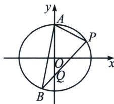

<!-- question-source:start -->
例2 (2024·新高考Ⅰ卷)已知 A(0,3) 和 P(3, $\frac{3}{2}$ ) 为椭圆 C: $\frac{x^{2}}{a^{2}} + \frac{y^{2}}{b^{2}} = 1 (a > b > 0)$ 上两点.

(1)求 C 的离心率;

(2)若过 P 的直线 l 交 C 于另一点 B，且 $\triangle ABP$ 的面积为 9，求 l 的方程.

(1)依题意， $\left\{ \begin{array}{l} \frac{9}{b^2} = 1 \\ \frac{9}{a^2} + \frac{4}{b^2} = 1 \end{array} \right.$ ，解得 $\left\{ \begin{array}{l} a^2 = 12 \\ b^2 = 9 \end{array} \right.$ ，则离心率 $e = \sqrt{1 - \frac{b^2}{a^2}} = \sqrt{1 - \frac{9}{12}} = \frac{1}{2}$ ；

(2)由
(1)可知,椭圆 $C$ 的方程为 $\frac{x^2}{12} +\frac{y^2}{9} = 1$ ，当直线 $l$ 的斜率不存在时，直线 $l$ 的方程为 $x = 3$ ，易知此时 $B(3, - \frac{3}{2})$ ，点 $A$ 到直线 $PB$ 的距离为 3，则 $S_{\triangle ABP} = \frac{1}{2}\times 3\times 3 = \frac{9}{2}$ ，与已知矛盾；
<!-- question-source:end -->

![[高中/总复习/专题/2026版高中《mst老唐说题》圆锥曲线专题（数学）/上册/第05章_常规韦达联立/第一节_正反设直线的方案选择/一_椭圆的正设与反设/例题/answers/Q00048570A1.md]]
