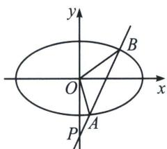

<!-- question-source:start -->
例3 (2025 新课标Ⅱ卷第 16 题) 椭圆 $C: \frac{x^{2}}{a^{2}} + \frac{y^{2}}{b^{2}} = 1 (a > b > 0)$ 的离心率为 $\frac{\sqrt{2}}{2}$ , 长轴长为 4。

(1)求椭圆 C 的方程;

(2) 过点 $(0, -2)$ 的直线 l 与椭圆 C 交于 A, B 两点，O 为坐标原点，若 $S_{\triangle OAB} = \sqrt{2}$ ，求 $|AB|$ 。

<!-- question-source:end -->

![[高中/总复习/专题/2026版高中《mst老唐说题》圆锥曲线专题（数学）/上册/第05章_常规韦达联立/第一节_正反设直线的方案选择/一_椭圆的正设与反设/例题/answers/Q00052991A1.md]]
