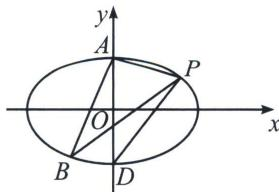

> [!faq]- 《圆锥曲线专题(上册)》例题解析
>
> > [!success]- **【答案】** 详见解析
>
> > [!note]- **【分析】**
> > 本题未单列分析。
>
> > [!note]- **【解析】**
> > 解析
> > 解法一(直接联立): 当直线 $l$ 的斜率存在时, 设直线 $l$ 的方程为 $y - \frac{3}{2} = k(x - 3)$ , 即 $y = k(x - 3) + \frac{3}{2}$ , 设 $P(x_1, y_1), B(x_2, y_2)$ , 联立 $\left\{ \begin{array}{l} y = k(x - 3) + \frac{3}{2} \\ \frac{x^2}{12} + \frac{y^2}{9} = 1 \end{array} \right.$ , 消去 $y$ 整理可得, $(4k^2 + 3)x^2 - (24k^2 - 12k)x + 36k^2 - 36k - 27 = 0$ , 则 $x_1 + x_2 = \frac{24k^2 - 12k}{4k^2 + 3}, x_1x_2 = \frac{36k^2 - 36k - 27}{4k^2 + 3}$ , 由弦长公式可得, $|PB| = \sqrt{1 + k^2} \cdot \sqrt{(x_1 + x_2)^2 - 4x_1x_2} = \sqrt{1 + k^2} \cdot \sqrt{\left(\frac{24k^2 - 12k}{4k^2 + 3}\right)^2 - 4 \times \frac{36k^2 - 36k - 27}{4k^2 + 3}} = \frac{4\sqrt{3} \cdot \sqrt{1 + k^2} \cdot \sqrt{3k^2 + 9k + \frac{27}{4}}}{4k^2 + 3}$ , 点 $A$ 到直线 $l$ 的距离为 $d = \frac{|3k + \frac{3}{2}|}{\sqrt{1 + k^2}}$ , 则 $\frac{1}{2} \times \frac{4\sqrt{3} \cdot \sqrt{1 + k^2} \cdot \sqrt{3k^2 + 9k + \frac{27}{4}}}{4k^2 + 3} \times \frac{|3k + \frac{3}{2}|}{\sqrt{1 + k^2}} = 9$ , 解得 $k = \frac{1}{2}$ 或 $k = \frac{3}{2}$ , 则直线 $l$ 的方程为 $y = \frac{1}{2}x$ 或 $y = \frac{3}{2}x - 3$ .
> > 
> > 解法二: 作 $BD \parallel AP$ 交 $y$ 轴于点 $D$ , 且有 $S_{\triangle ABP} = S_{\triangle ADP} = 9$ , 可得 $D(0, -3)$ , 由于 $k_{AP} = \frac{\frac{3}{2} - 3}{3 - 0} = -\frac{1}{2}$ 设直线 $l_{BD}: y = -\frac{1}{2} x - 3$ , 联立椭圆有: $\left\{ \begin{array}{l} y = -\frac{1}{2} x - 3 \\ \frac{x^2}{12} + \frac{y^2}{9} = 1 \end{array} \right. \Rightarrow 4x^2 + 12x = 0 \Rightarrow \left\{ \begin{array}{l} x_B = 0 \\ y_B = -3 \end{array} \right.$ 或 $\left\{ \begin{array}{l} x_B = -3 \\ y_B = -\frac{3}{2} \end{array} \right.$ 所以直线直线 $l$ 为 $y = \frac{1}{2} x$ 或 $y = \frac{3}{2} x - 3$ , 即 $3x - 2y - 6 = 0$ 或 $x - 2y = 0$ . 解法三: (参数方程)先求得直线 $AP$ 的方程为 $x + 2y - 6 = 0$ , 点 $B$ 到直线 $AP$ 的距离 $d = \frac{12\sqrt{5}}{5}$ , 设 $B(2\sqrt{3}\cos \theta, 3\sin \theta)$ , 其中 $\theta \in [0, 2\pi)$ , 则有 $\frac{|2\sqrt{3}\cos \theta + 6\sin \theta - 6|}{\sqrt{5}} = \frac{12\sqrt{5}}{5}$ , 联立 $\cos^2\theta + \sin^2\theta = 1$ , 解得 $\left\{ \begin{array}{l} \cos \theta = -\frac{\sqrt{3}}{2} \\ \sin \theta = -\frac{1}{2} \end{array} \right.$ 或 $\left\{ \begin{array}{l} \cos \theta = 0 \\ \sin \theta = -1 \end{array} \right.$ , 即 $B(0, -3)$ 或 $(-3, -\frac{3}{2})$ , 所以直线直线 $l$ 为 $y = \frac{1}{2} x$ 或 $y = \frac{3}{2} x - 3$ , 即 $3x - 2y - 6 = 0$ 或 $x - 2y = 0$ .
> > 注意 考虑数形结合，几何法最简单，不考虑数形结合的情况，参数方程换元是解决弦长面积相对简单的方法。当下高考，注重本质背景，不是技巧。
