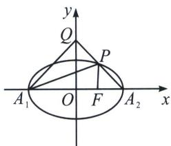

> [!faq]- 《圆锥曲线专题(上册)》例题解析
>
> > [!success]- **【答案】** 详见解析
>
> > [!note]- **【解析】**
> > 解析 (1)由题意可知， $\left\{ \begin{array}{l}a + c = 3\\ a - c = 1 \end{array} \right.$ ，解得 $\left\{ \begin{array}{l}a = 2\\ c = 1 \end{array} \right.$ ，所以 $b^{2} = a^{2} - c^{2} = 4 - 1 = 3.$
> >
> > 则椭圆方程为 $\frac{x^{2}}{4}+\frac{y^{2}}{3}=1$ ，椭圆的离心率为 $e=\frac{c}{a}=\frac{1}{2}$ ;
> >
> > (2)
> > 解法一: 由题意可知, 直线 $A_{2} P$ 的斜率存在且不为 0 , 当 $k < 0$ 时, 直线方程为 $y = k(x - 2)$ , 取 $x = 0$ , 得 $Q(0, -2k)$ . 联立 $\left\{ \begin{array}{l} y = k(x - 2) \\ \frac{x^{2}}{4} + \frac{y^{2}}{3} = 1 \end{array} \right.$ , 得 $(4k^{2} + 3)x^{2} - 16k^{2}x + 16k^{2} - 12 = 0$ .
> >
> > 
> >
> > $\Delta = (-16k^2)^2 - 4(4k^2 + 3)(16k^2 - 12) = 144 > 0$ ， $2x_P = \frac{16k^2 - 12}{4k^2 + 3}$ ，得 $x_P = \frac{8k^2 - 6}{4k^2 + 3}$ ，则 $y_P = \frac{-12k}{4k^2 + 3}$ .
> >
> > $$
> > S _ {\triangle A _ {1} P Q} = \left| S _ {\triangle A _ {1} A _ {2} Q} - S _ {\triangle A _ {1} A _ {2} P} \right| = \left| \frac {1}{2} \times 4 \times (- 2 k) - \frac {1}{2} \times 4 \times \left(- \frac {1 2 k}{4 k ^ {2} + 3}\right) \right| = \left| \frac {- 1 6 k ^ {3} + 1 2 k}{4 k ^ {2} + 3} \right|. S _ {\triangle A _ {2} F P} = \frac {1}{2} \times 1
> > $$
> >
> > $\times \left(-\frac{12k}{4k^2 + 3}\right) = -\frac{6k}{4k^2 + 3}$ . 所以 $\left|\frac{-16k^3 + 12k}{4k^2 + 3}\right| = -\frac{12k}{4k^2 + 3}$ , 即 $2k^2 = 3$ , 得 $k = -\frac{\sqrt{6}}{2} (k < 0)$ ;
> >
> > 同理求得当 $k > 0$ 时， $k = \frac{\sqrt{6}}{2}$ 。所以直线 $A_{2}P$ 的方程为 $y = \pm \frac{\sqrt{6}}{2}(x - 2)$ 。
> >
> > 解法二(几何转化): 由于 $S_{\triangle A_1PQ} = 2S_{\triangle A_2FP}$ , 且 $|A_1F| = 3|A_2F|$ , 所以 $S_{\triangle A_1PA_2} = 4S_{\triangle A_2FP} = 2S_{\triangle A_1PQ}$ , 所以 $|A_2P| = 2|PQ|$ , 所以 $P\left(\frac{2}{3}, \pm \frac{2\sqrt{6}}{3}\right)$ , 故 $k_{AP} = \pm \frac{\sqrt{6}}{2}$ , 直线 $A_2P$ 的方程为 $y = \pm \frac{\sqrt{6}}{2}(x - 2)$ .
