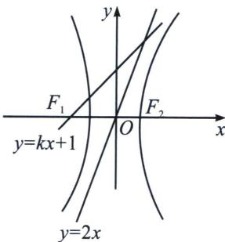

<!-- question-source:start -->
例7 (2024·多选·茂名模拟)已知双曲线 $C: 4x^{2} - y^{2} = 1$ , 直线 $l: y = kx + 1 (k > 0)$ , 则下列说法正确的是 ( )
A. 若 $k = 2$ , 则 $l$ 与 $C$ 仅有一个公共点 B. 若 $k = 2 \sqrt{2}$ , 则 $l$ 与 $C$ 仅有一个公共点 C. 若 $l$ 与 $C$ 有两个公共点, 则 $2 < k < 2 \sqrt{2}$ D. 若 $l$ 与 $C$ 没有公共点, 则 $k > 2 \sqrt{2}$

<!-- question-source:end -->

![[高中/总复习/专题/2026版高中《mst老唐说题》圆锥曲线专题（数学）/上册/第05章_常规韦达联立/第一节_正反设直线的方案选择/二_双曲线的正设与反设/例题/answers/Q00048576A1.md]]
