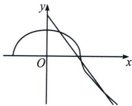

> [!faq]- 《圆锥曲线专题(上册)》例题解析
>
> > [!success]- **【答案】** ACD
>
> > [!note]- **【解析】**
> > 解析 因为曲线 $C_1: y = k|x| + 2$ 与曲线 $C_2: \frac{x^2}{2} + y|y| = 1$ 都关于 $y$ 轴对称，所以当 $x > 0$ 时，曲线 $C_1$ 与曲线 $C_2$ 有3个交点，而当 $y \geqslant 0$ 时， $C_2: \frac{x^2}{2} + y^2 = 1$ ，当 $y < 0$ 时， $C_2: \frac{x^2}{2} - y^2 = 1$ ，其图象如图所示：
> >
> > 
> >
> > 显然 $k < 0$ ，要使当 $x > 0$ 时，曲线 $C_1$ 与曲线 $C_2$ 有 3 个交点，则直线 $y = kx + 2$ 与 $\frac{x^2}{2} + y^2 = 1$ 有两个交点，或与 $\frac{x^2}{2} - y^2 = 1$ 有两个交点，
> >
> > 由 $\left\{\begin{aligned}y=kx+2\\ x^{2}+2y^{2}-2=0\end{aligned}\right.$ ，得 $(2k^{2}+1)x^{2}+8kx+6=0,\Delta=64k^{2}-24(2k^{2}+1)>0$ ，解得 $-\frac{\sqrt{2}}{2}\leqslant k<-\frac{\sqrt{6}}{2};$ 由 $\left\{\begin{aligned}y=kx+2\\ x^{2}-2y^{2}-2=0\end{aligned}\right.$ ，得 $(2k^{2}-1)x^{2}+8kx+10=0,\Delta=64k^{2}-40(2k^{2}-1)>0$ ，解得 $-\frac{\sqrt{10}}{2}<k\leqslant-\frac{\sqrt{2}}{2}\leqslant k;$ 综上， $-\frac{\sqrt{10}}{2}<k<-\frac{\sqrt{6}}{2}$ . 故选 ACD.
> >
> > ## 2. 双曲线弦长面积问题
> >
> > 问题：双曲线 $\frac{x^{2}}{a^{2}}-\frac{y^{2}}{b^{2}}=1(a>0,\ b>0)$ 与直线l： $y=kx+m$ 相交于AB两点，求AB的弦长.
> >
> > 双曲线正设和反设差距不大, 所以我们一般用正设, 双曲线很多侧重点在于渐近线体系, 正设的斜率直接对接渐近线斜率 $\pm \frac{b}{a}$ , 所以本文先介绍正设, 反设模仿椭圆的, 就是替换 $a$ 与 $b$ 即可, 会在后面介绍.
> >
> > 设 $A(x_{1},y_{1})$ ， $B(x_{2},y_{2})$ ，则 $\vert AB\vert = \sqrt{(x_2 - x_1)^2 + (y_2 - y_1)^2} = \sqrt{1 + k^2}\sqrt{(x_1 + x_2)^2 - 4x_1x_2}$
> >
> > 将 $y = kx + m$ 代入 $\frac{x^2}{a^2} -\frac{y^2}{b^2} = 1$ 得： $(b^{2} - k^{2}a^{2})x^{2} - 2a^{2}kmx - a^{2}m^{2} - a^{2}b^{2} = 0$ 所以 $\left\{ \begin{array}{l}x_{1} + x_{2} = -\frac{2a^{2}km}{b^{2} - k^{2}a^{2}}\\ x_{1}\cdot x_{2} = \frac{-a^{2}m^{2} - a^{2}b^{2}}{b^{2} - k^{2}a^{2}} \end{array} \right.$ 所
> >
> > $$
> > \vert A B \vert = \sqrt {1 + k ^ {2}} \sqrt {\left(x _ {1} + x _ {2}\right) ^ {2} - 4 x _ {1} x _ {2}} = \sqrt {1 + k ^ {2}} \frac {2 a b \sqrt {b ^ {2} - k ^ {2} a ^ {2} + m ^ {2}}}{\left| b ^ {2} - a ^ {2} k ^ {2} \right|}
> > $$
> >
> > 双曲线与直线交点的判别式： $\Delta=4a^{2}b^{2}(b^{2}-k^{2}a^{2}+m^{2})$ 用来判断是否有两个交点问题.
> >
> > 面积问题: 双曲线与直线 $l: y = kx + m$ 相交与两点, $C(x_0, y_0)$ 为 $AB$ 外任意一点, 求 $S_{\triangle ABC}$ 。设 $C$ 到 $l$ 的距离为 $d$ , 则 $S_{\triangle ABC} = \frac{1}{2} |AB| d = \frac{1}{2} |AB| \frac{|kx_0 - y_0 + m|}{\sqrt{k^2 + 1}} = \frac{|kx_0 - y_0 + m| \cdot ab \sqrt{b^2 - k^2 a^2 + m^2}}{|b^2 - k^2 a^2|}$
