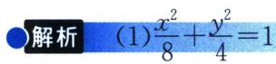
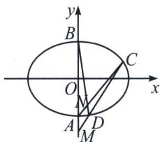

<!-- question-source:start -->
例1 (2023·赣州教师竞赛)已知椭圆 $Q: \frac{x^2}{a^2} + \frac{y^2}{b^2} = 1 (a > b > 0)$ 的离心率为 $\frac{\sqrt{2}}{2}$ , 椭圆 $Q$ 上的点, 与 $P(1, 0)$ 的最大距离为 $2\sqrt{2} + 1$ .

(1)求椭圆 Q 的方程;

(2)设椭圆 $Q$ 的下、上顶点分别为 $A 、 B$ , 过点 $P$ 的直线与椭圆 $Q$ 交于 $C 、 D$ 两点, 与 $y$ 轴交于点 $M$ , 直线 $A C$ 与直线 $B D$ 交于点 $N$ , 试探究 $\overrightarrow {O M} \cdot \overrightarrow {O N}$ 是否为定值.

(2)分析: 此题的背景是极点极线, 所求直线是极点 $M(0, m)$ 所对应的极线 $y = \frac{4}{m}$ , 那么点 $P(1, 0)$ 在本题中属于多余条件, 往往能够迷惑大家, 不过也能简化一些计算.

<!-- question-source:end -->

![[高中/总复习/专题/2026版高中《mst老唐说题》圆锥曲线专题（数学）/上册/第05章_常规韦达联立/第三节_运算技巧下的韦达定理拓展/一_轴点弦的和积互换/例题/answers/Q00048593A1.md]]
