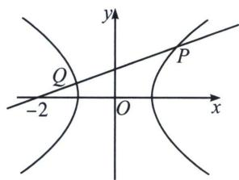
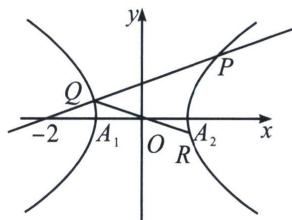

> [!faq]- 《圆锥曲线专题(上册)》例题解析
>
> > [!success]- **【答案】** 详见解析
>
> > [!note]- **【解析】**
> > 解析 (1)因为 $e = 2$ ，即 $\frac{c}{a} = 2$ ，所以 $\frac{c^2}{a^2} = 4$ ，又因为 $a^2 = 1$ ，所以 $c^2 = 4$ ，又因为 $a^2 + b^2 = c^2$
> >
> > $$
> > b ^ {2} = 3
> > $$
> >
> > $$
> > b = \sqrt {3}
> > $$
> >
> > (2)因为 $\triangle MA_{2}P$ 为等腰三角形, ①若 $A_{1}A_{2}$ 为底, 则点 $P$ 在线段 $MA_{2}$ 的中垂线, 即 $x=-\frac{1}{2}$ 上, 与 $P$ 双曲线上且在第一象限矛盾, 故舍去;
> > - **②**：若 $A_{2}P$ 为底，则 $MP=MA_{2}$ ，与 $MP>MA_{2}$ 矛盾，故舍去；
> > - **③**：若 $MP$ 为底，则 $MA_{2} = PA_{2}$ ，设 $P(x_{0}, y_{0})$ ， $x_{0} > 0$ ， $y_{0} > 0$ ，则 $\sqrt{(x_{0} - 1)^{2} + (y_{0} - 0)^{2}} = 3$ ，即 $(x_{0} - 1)^{2} + y_{0}^{2} = 9$ ，又因为 $x_{0}^{2} - \frac{y_{0}^{2}}{\frac{8}{3}} = 1$ ，得 $(x_{0} - 1)^{2} + \frac{8}{3}(x_{0}^{2} - 1) = 9$ ，得 $11x_{0}^{2} - 6x_{0} - 32 = 0$ ，解得 $x_{0} = 2$ ， $y_{0} = 2\sqrt{2}$ ，即 $P(2, 2\sqrt{2})$ ；
> >
> > 
> >
> > 
> >
> > (3)由 $A_{1}(-1,0)$ ，设 $P(x_{1},y_{1})$ ， $Q(x_{2},y_{2})$ ，则 $R(-x_{2},-y_{2})$ ，设直线 l: $x=my-2\left(m>\frac{1}{b}\right)$ ,
> >
> > 联立 $\left\{\begin{aligned}x&=my-2\\ x^{2}&-\frac{y^{2}}{b^{2}}=1\\ m&>\frac{1}{b}\end{aligned}\right.$ ，得 $(b^{2}m^{2}-1)y^{2}-4b^{2}my+3b^{2}=0$ ，则 $y_{1}+y_{2}=\frac{4b^{2}m}{b^{2}m^{2}-1}$ ， $y_{1}y_{2}=\frac{3b^{2}}{b^{2}m^{2}-1}$
> >
> > 所以 $\overrightarrow{A_1R} = (-x_2 + 1, -y_2), \overrightarrow{A_2P} = (x_1 - 1, y_1)$ ，又因为 $\overrightarrow{A_1R} \cdot \overrightarrow{A_2P} = 1$ ，得 $(-x_2 + 1)(x_1 - 1) - y_1y_2 = 1$ ，则 $(x_2 - 1)(x_1 - 1) + y_1y_2 = -1$ ，即 $(my_2 - 3)(my_1 - 3) + y_1y_2 = -1$ ，化简后可得到 $(m^2 + 1)y_1y_2 - 3m(y_1 + y_2) + 10 = 0$ ，
> >
> > 再由韦达定理得 $3b^{2}(m^{2}+1)-12m^{2}b^{2}+10(b^{2}m^{2}-1)=0$ ，化简得 $b^{2}m^{2}+3b^{2}-10=0$ ，所以 $m^{2}=\frac{10}{b^{2}}-3>\frac{1}{b^{2}}$ ，所以 $b^{2}<3$ ，解得 $0<b<\sqrt{3}$ ， $b\in(0,\sqrt{3})$ 。
> >
> > ## 2. 点乘双根法
> >
> > (1)点乘双根法的原理
> >
> > 我们要计算 $(x_{1} - t)(x_{2} - t)$ 这个量，此时当然可以将其展开，利用韦达定理来进行计算，但更简单的操作方法是利用二次函数的两根式，得出 $ax^{2} + bx + c = a(x - x_{1})(x - x_{2})$ ，并在两端同时令 $x = t$ ，即可得到 $at^{2} + bt + c = a(t - x_{1})(t - x_{2})$ ，从而 $(x_{1} - t)(x_{2} - t) = \frac{at^{2} + bt + c}{a}$ ，这种方法叫做“点乘双根法”
> >
> > $\overrightarrow{PA} \cdot \overrightarrow{PB} = (x_{1} - x_{0})(x_{2} - x_{0}) + (y_{1} - y_{0})(y_{2} - y_{0})$ ，从而构建出关于参数的等式关系式，避免复杂的计算，达到快速解题的目的(其中，点P坐标 $(x_{0}, y_{0})$ 为已知定点， $A(x_{1}, y_{1})$ ， $B(x_{2}, y_{2})$ 为直线l与圆锥曲
> >
> > 线的交点.
> >
> > ## (2)点乘双根法适用题型
> >
> > 在圆锥曲线中, 遇到如 $\overrightarrow{PA} \cdot \overrightarrow{PB} = m$ (其中 $m$ 为常数) 的形式, 其中点 $P$ 是已知的点, $A$ , $B$ 为直线 $l$ 与圆雉曲线的交点的问题时, 可用点乘双根法以达到简化运算.
