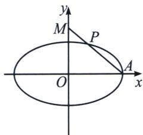
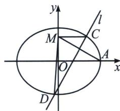

> [!faq]- 《圆锥曲线专题(上册)》例题解析
>
> > [!success]- **【答案】** 详见解析
>
> > [!note]- **【解析】**
> > 解析 (1)由题意知， $\Gamma: \frac{x^2}{a^2} + \frac{y^2}{5} = 1 (a > \sqrt{5})$ ，则 $b^2 = 5$ ，由右焦点(2,0)，可知 $c = 2$ ，则 $a = \sqrt{5 + c^2} = 3$ ，故离心率 $e = \frac{c}{a} = \frac{2}{3}$ .
> >
> > (2)由题意 $A(4,0), M(0,m)(m > 0), P(x_P, y_P)$ 由 $\overrightarrow{PA} = 2\overrightarrow{MP}$ 得， $\left\{ \begin{array}{l} 4 - x_P = 2x_P \\ -y_P = 2y_p - 2m \end{array} \right.$ ，解得 $P\left(\frac{4}{3}, \frac{2m}{3}\right)$ ，代入 $\frac{x^2}{16} + \frac{y^2}{5} = 1$ ，得 $\frac{1}{9} + \frac{4m^2}{45} = 1$ ，又 $m > 0$ ，解得 $m = \sqrt{10}$ .
> >
> > 
> >
> > 
> >
> > (3)由线段 $AM$ 的中垂线 $l$ 的斜率为 2，所以直线 $AM$ 的斜率为 $-\frac{1}{2}$ ，则 $\frac{m - 0}{0 - a} = -\frac{1}{2}$ ，解得 $m = \frac{a}{2}$ ，
> >
> > 由 $A(a,0),M\left(0,\frac{a}{2}\right)$ 得 $AM$ 中点坐标为 $\left(\frac{a}{2},\frac{a}{4}\right)$ ，故直线 $l:y = 2x - \frac{3}{4} a$ ，显然直线 $l$ 过椭圆内点 $\left(\frac{3}{8} a,0\right)$ ，故直线与椭圆恒有两不同交点，设 $C(x_{1},y_{1}),D(x_{2},y_{2})$ ，由 $\left\{ \begin{array}{ll}y = 2x - \frac{3}{4} a\\ 5x^{2} + a^{2}y^{2} = 5a^{2} \end{array} \right.$ 消 $y$ 得 $(4a^{2} + 5)$
> >
> > $x^{2} - 3a^{3}x + \frac{9}{16} a^{4} - 5a^{2} = 0$ ，由韦达定理得 $x_{1} + x_{2} = \frac{3a^{3}}{4a^{2} + 5}, x_{1}x_{2} = \frac{\frac{9}{16}a^{4} - 5a^{2}}{4a^{2} + 5},$
> >
> > 因为 $\angle CMD$ 为钝角，则 $\overrightarrow{MC}\cdot\overrightarrow{MD}<0$ ，且 $M(0,\frac{a}{2})$ ，则有 $x_{1}x_{2}+\left(y_{1}-\frac{a}{2}\right)\left(y_{2}-\frac{a}{2}\right)<0$ ，
> >
> > 所以 $x_{1}x_{2} + \left(2x_{1} - \frac{5a}{4}\right)\left(2x_{2} - \frac{5a}{4}\right) = 5x_{1}x_{2} - \frac{5}{2} a(x_{1} + x_{2}) + \frac{25}{16} a^{2} < 0,$
> >
> > 即 $5\left(\frac{9}{16} a^4 - 5a^2\right) - \frac{5a}{2} \times 3a^3 + \frac{25}{16} a^2 (4a^2 + 5) < 0$ ，解得 $a^2 < 11$ ，又 $a > \sqrt{5}$ ，
> >
> > 故 $\sqrt{5}<a<\sqrt{11}$ ，即a的取值范围是 $(\sqrt{5},\sqrt{11})$ .
