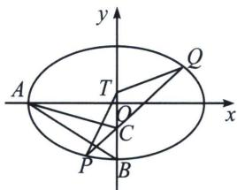

> [!faq]- 《圆锥曲线专题(上册)》例题解析
>
> > [!success]- **【答案】** 详见解析
>
> > [!note]- **【解析】**
> > 解析 (1)因为椭圆的离心率为 $e = \frac{1}{2}$ , 所以 $\frac{c}{a} = \frac{1}{2}$ , 即 $a = 2c$ , 其中 $c$ 为半焦距, $a^2 = b^2 + c^2$ ,
> >
> > 则 $b = \sqrt{3} c$ ，所以 $A(-2c,0),B(0, - \sqrt{3} c),C\left(0, - \frac{\sqrt{3} c}{2}\right),S_{\triangle ABC} = \frac{1}{2}\times 2c\times \frac{\sqrt{3}}{2} c = \frac{3\sqrt{3}}{2}$ ，解得 $c = \sqrt{3}$
> >
> > 故 $a=2\sqrt{3}$ ，b=3，故椭圆方程为 $\frac{x^{2}}{12}+\frac{y^{2}}{9}=1$ ;
> >
> > (2)
> > 解法一(直接联立): ①若过点 $\left(0,-\frac{3}{2}\right)$ 的动直线的斜率不存在, 则 $P(0,3)$ , $Q(0,-3)$ 或 $P(0,-3)$ , $Q(0,3)$ , 此时 $-3 \leqslant t \leqslant 3$ ,
> >
> > 
> > - **②**：若过点 $\left(0, -\frac{3}{2}\right)$ 的动直线的所率存在，则可设该直线方程为： $y = kx - \frac{3}{2}$ ，设 $P(x_{1}, y_{1})Q(x_{2}, y_{2})$ ， $T(0, t), \begin{cases} y = kx - \frac{3}{2} \\ 3x^{2} + 4y^{2} = 36 \end{cases}$ ，化简整理可得， $(3 + 4k^{2})x^{2} - 12kx - 27 = 0$ ，
> >
> > $$
> > \text { 攻 } \triangle = 1 4 4 k ^ {2} + 1 0 8 (3 + 4 k ^ {2}) = 3 2 4 + 5 7 6 k ^ {2} > 0 x _ {1} + x _ {2} = \frac {1 2 k}{3 + 4 k ^ {2}}, x _ {1} x _ {2} = - \frac {2 7}{3 + 4 k ^ {2}};
> > $$
> >
> > $$
> > \overrightarrow {T P} = \left(x _ {1}, y _ {1} - t\right), \overrightarrow {T Q} = \left(x _ {2}, y _ {2} - t\right),
> > $$
> >
> > 故 $\overrightarrow{TP} \cdot \overrightarrow{TQ} = x_{1}x_{2} + (y_{1} - t)(y_{2} - t) = x_{1}x_{2} + \left(kx_{1} - \frac{3}{2} - t\right)\left(kx_{2} - \frac{3}{2} - t\right) = (1 + k^{2})x_{1}x_{2} - k\left(\frac{3}{2} + t\right)(x_{1} + x_{2}) + \left(\frac{3}{2} + t\right)^{2} = \frac{\left[(3 + 2t)^{2} - 12t - 45\right]k^{2} + 3\left(\frac{3}{2} + t\right)^{2} - 27}{3 + 4k^{2}},$
> >
> > $\overrightarrow{TP} \cdot \overrightarrow{TQ} \leqslant 0$ 恒成立，故 $\left\{ \begin{array}{l} 3\left(\frac{3}{2} + t\right)^2 - 27 \leqslant 0 \\ (3 + 2t)^2 - 12t - 45 \leqslant 0 \end{array} \right.$ ，解得 $-3 \leqslant t \leqslant \frac{3}{2}$ ，若 $\overrightarrow{TP} \cdot \overrightarrow{TQ} \leqslant 0$ 恒成立。结合①②可知， $-3 \leqslant t \leqslant \frac{3}{2}$ 。故这个 $T$ 点纵坐标的取值范围为 $\left[-3, \frac{3}{2}\right]$ 。
> >
> > 解法二：（点乘双根）若过点 $\left(0, -\frac{3}{2}\right)$ 的直线 $PQ$ 斜率不存在，此时 $P(0, 3)$ ， $Q(0, -3)$ 或 $P(0, -3)$ ， $Q(0, 3)$ ，则： $\overrightarrow{TP} \cdot \overrightarrow{TQ} = (t + 3)(t - 3) \leqslant 0$ ，解得： $-3 \leqslant t \leqslant 3$ ，若过点 $\left(0, -\frac{3}{2}\right)$ 的动直线的斜率存在，设该直线方程为： $y = kx - \frac{3}{2}$ ，设 $P(x_1, y_1)$ ， $Q(x_2, y_2)$ ， $T(0, t)$ ，
> >
> > $\left\{ \begin{array}{l} 3x^{2} + 4y^{2} = 36 \\ y = kx - \frac{3}{2} \end{array} \right.$ 可得 $(3 + 4k^{2})x^{2} - 12kx - 27 = (3 + 4k^{2})(x - x_{1})(x - x_{2})$ ①，
> >
> > 即有： $(x - x_{1})(x - x_{2}) = x^{2} - \frac{12kx + 27}{3 + 4k^{2}}$
> >
> > $$
> > \text {由} \overrightarrow {T P} \cdot \overrightarrow {T Q} = x _ {1} x _ {2} + (y _ {1} - t) (y _ {2} - t) = x _ {1} x _ {2} + \left(k x _ {1} - \frac {3}{2} - t\right) \left(k x _ {2} - \frac {3}{2} - t\right) = x _ {1} x _ {2} + k ^ {2} \left(x _ {1} - \frac {\frac {3}{2} + t}{k}\right) \left(x _ {2} - \frac {\frac {3}{2} + t}{k}\right)
> > $$
> >
> > 当 $x = 0$ 时，由①式可得： $x_{1}x_{2} = -\frac{27}{3 + 4k^{2}}$
> >
> > 当 $x = \frac{\frac{3}{2} + t}{k}$ 时， $\left(x_{1} - \frac{\frac{3}{2} + t}{k}\right)\left(x_{2} - \frac{\frac{3}{2} + t}{k}\right) = \left(\frac{\frac{3}{2} + t}{k}\right)^{2} - \frac{12k\frac{\frac{3}{2} + t}{k} + 27}{3 + 4k^{2}} = \left(\frac{\frac{3}{2} + t}{k}\right)^{2} - \frac{12t + 45}{3 + 4k^{2}}$ 所以 $\overrightarrow{TP}\cdot \overrightarrow{TQ} = x_1x_2 + k^2\left(x_1 - \frac{\frac{3}{2} + t}{k}\right)\left(x_2 - \frac{\frac{3}{2} + t}{k}\right) = \frac{[(3 + 2t)^2 - 12t - 45]k^2 + 3\left(\frac{3}{2} + t\right)^2 - 27}{3 + 4k^2}$ 因为 $\overrightarrow{TP}\cdot \overrightarrow{TQ}\leqslant 0$ 恒成立，则 $\left\{ \begin{array}{l}(3 + 2t)^2 -12t - 45\leqslant 0\\ 3(+t)^2 -27\leqslant 0 \end{array} \right.\Rightarrow -3\leqslant t\leqslant \frac{3}{2}$ ，故 $-3\leqslant t\leqslant \frac{3}{2};$
