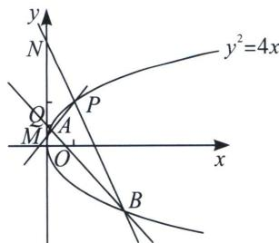

<!-- question-source:start -->
例1 (2018·北京理)已知抛物线 $C: y^{2} = 2px$ 经过点 $P(1, 2)$ , 过点 $Q(0, 1)$ 的直线 $l$ 与抛物线 $C$ 有两个不同的交点 $A, B$ , 且直线 $PA$ 交 $y$ 轴于 $M$ , 直线 $PB$ 交 $y$ 轴于 $N$ .

(1)求直线 l 的斜率的取值范围;

(2)设 O 为原点， $\overrightarrow{QM}=\lambda\overrightarrow{QO}$ ， $\overrightarrow{QN}=\mu\overrightarrow{QO}$ 求证： $\frac{1}{\lambda}+\frac{1}{\mu}$ 为定值.

(1)因为抛物线 $C: y^{2} = 2px$ 经过点 $P(1, 2)$ , 所以 $4 = 2p$ , 解得 $p = 2$ , 设直线 $l$ 方程为 $y = kx + 1$ , $A(x_{1}, y_{1})$ , $B(x_{2}, y_{2})$ , 联立方程组可得 $\left\{ \begin{array}{l} y^{2} = 4x \\ y = kx + 1 \end{array} \right.$ , $k^{2}x^{2} + (2k - 4)x + 1 = 0$ , $\Delta = (2k - 4)^{2} - 4k^{2} > 0$ , 且 $k \neq 0$ 解得 $k < 1$ , 且 $k \neq 0$ , 又因为 $PA$ 、 $PB$ 要与 $y$ 轴相交, 故直线 $l$ 不能经过点 $(1, -2)$ , 所以 $k \neq -3$ , 所以直线 $l$ 的斜率的取值范围 $(- \infty, -3) \cup (-3, 0) \cup (0, 1)$ :

(2) $k_{AB}=\frac{y_{1}-y_{2}}{x_{1}-x_{2}}=\frac{4(y_{1}-y_{2})}{y_{1}^{2}-y_{2}^{2}}=\frac{4}{y_{1}+y_{2}}$ ，故直线AB方程为：

$y-y_{1}=\frac{4}{y_{1}+y_{2}}\left(x-\frac{y_{1}^{2}}{4}\right)$ ，化简可得： $(y_{1}+y_{2})y=4x+y_{1}y_{2}$ 。由于直线AB过Q(0,1)，所以 $y_{1}+y_{2}=y_{1}y_{2}$ ，同理：AP方程： $(y_{1}+2)y=4x+2y_{1}$ ；BP方程： $(2+y_{2})y=4x+2y_{2}$ ，令x=0，得 $y_{M}=\frac{2y_{1}}{2+y_{1}}$ ，同理可得 $y_{N}=\frac{2y_{2}}{2+y_{2}}$ ， $\frac{1}{\lambda}+\frac{1}{\mu}=\frac{1}{1-y_{M}}+\frac{1}{1-y_{N}}=\frac{2+y_{1}}{2-y_{1}}+\frac{2+y_{2}}{2-y_{2}}=\frac{8-2y_{1}y_{2}}{(2-y_{1})(2-y_{2})}=\frac{8-2y_{1}y_{2}}{4-2(y_{1}+y_{2})+y_{1}y_{2}}=\frac{8-2y_{1}y_{2}}{4-y_{1}y_{2}}=2$ ，所以 $\frac{1}{\lambda}+\frac{1}{\mu}=2$ ，所以 $\frac{1}{\lambda}+\frac{1}{\mu}$ 为定值。
<!-- question-source:end -->

![[高中/总复习/专题/2026版高中《mst老唐说题》圆锥曲线专题（数学）/上册/第06章_联立之同构方程/第一节_抛物线两点联立式方程/一_抛物线两点联立式同构与定点定值/例题/answers/Q00048595A1.md]]
