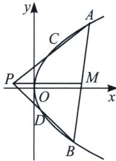

<!-- question-source:start -->
例6 (2021·浙江卷)如图, 已知点 $P$ 是 $y$ 轴左侧 (不含 $y$ 轴) 一点, 抛物线 $E: y^{2} = 4x$ 上存在不同的两点 $A, B$ 满足 $PA, PB$ 的中点均在 $E$ 上.

(1)设 $AB$ 中点为 $M$ , 证明: $PM$ 垂直于 $y$ 轴;

(2) 若 $P$ 是半椭圆 $x^{2} + \frac{y^{2}}{4} = 1 (x < 0)$ 上的动点, 求 $\triangle PAB$ 面积的取值范围.

(1)证明: 设 $P(m, n)$ , $A(x_1, y_1)$ , $B(x_2, y_2)$ , $AB$ 中点 $M$ 的坐标为 $\left(\frac{x_1 + x_2}{2}, \frac{y_1 + y_2}{2}\right)$ , $PA$ 中点坐标为 $C\left(\frac{m + x_1}{2}, \frac{n + y_1}{2}\right)$ , $PB$ 中点坐标为 $D\left(\frac{m + x_2}{2}, \frac{n + y_2}{2}\right)$ , 由于 $k_{AB} = \frac{y_2 - y_1}{x_2 - x_1} = \frac{y_2 - y_1}{\frac{y_2^2}{4} - \frac{y_1^2}{4}}$ , 得到 $k_{AB} = \frac{4}{y_1 + y_2}$ , 故直线 $AB$ 方程为: $y - y_1 = \frac{4}{y_1 + y_2}\left(x - \frac{y_1^2}{2p}\right)$ , 化简可得: $(y_1 + y_2)y = 4x + y_1y_2①$ , 同理 $CD$ 的方程为: $\left(\frac{n + y_1}{2} + \frac{n + y_2}{2}\right)y = 4x + \frac{n + y_1}{2} \cdot \frac{n + y_2}{2}$ , 由于 $AB // CD$ , 故 $y_1 + y_2 = \frac{n + y_1}{2} + \frac{n + y_2}{2}$ , 即 $n = \frac{y_1 + y_2}{2}$ . 即 $PM$ 垂直于 $y$ 轴;

(2)因为 $P$ 是半椭圆 $x^{2} + \frac{y^{2}}{4} = 1(x <   0)$ 上的动点，所以 $m^2 +\frac{n^2}{4} = 1$ ， $-1\leqslant m <   0$ ， $-2 <   n <   2$

根据①式得：AC 的方程为 $\left(\frac{n+y_{1}}{2}+y_{1}\right)y=4x+\frac{n+y_{1}}{2}\cdot y_{1}$ ，代入点 $P(m,n)$ 得： $\left(\frac{n+y_{1}}{2}+y_{1}\right)n=4m+\frac{n+y_{1}}{2}\cdot y_{1}$ ，即 $\frac{y_{1}^{2}}{2}-ny_{1}+4m-\frac{n^{2}}{2}=0$ ，同理，我们可以通过 BD 的方程得到 $\frac{y_{2}^{2}}{2}-ny_{2}+4m-\frac{n^{2}}{2}=0$ ，所以 $y_{1}$ 、 $y_{2}$ 均在同构方程 $\frac{y^{2}}{2}-ny+4m-\frac{n^{2}}{2}=0$ 上，即 $y_{1}+y_{2}=2n$ ， $y_{1}y_{2}=8m-n^{2}$ ，故 $\triangle PAB$ 面积 $S=\frac{1}{2}|x_{M}-m|\cdot|y_{1}-y_{2}|=\frac{1}{2}\left(\frac{y_{1}^{2}+y_{2}^{2}}{8}-m\right)\cdot\sqrt{(y_{1}+y_{2})^{2}-4y_{1}y_{2}}=\left[\frac{1}{16}\cdot(4n^{2}-16m+2n^{2})-\frac{1}{2}m\right]\cdot\sqrt{4n^{2}-32m+4n^{2}}$ $=\frac{3\sqrt{2}}{4}(n^{2}-4m)\sqrt{n^{2}-4m}$ ，令 $t=\sqrt{n^{2}-4m}=\sqrt{4-4m^{2}-4m}=\sqrt{-4\left(m+\frac{1}{2}\right)^{2}+5}$ ，可得 $m=-\frac{1}{2}$ 时，t 取得最大值 $\sqrt{5}$ ；m=-1 时，t 取得最小值 2，即 $2\leqslant t\leqslant\sqrt{5}$ ，则 $S=\frac{3\sqrt{2}}{4}t^{3}$ 在 $2\leqslant t\leqslant\sqrt{5}$ 递增，可得 $S\in\left[6\sqrt{2},\frac{15}{4}\sqrt{10}\right]$ ,

所以 $\triangle PAB$ 面积的取值范围为 $\left[6\sqrt{2}, \frac{15}{4}\sqrt{10}\right]$ .
<!-- question-source:end -->

![[高中/总复习/专题/2026版高中《mst老唐说题》圆锥曲线专题（数学）/上册/第06章_联立之同构方程/第一节_抛物线两点联立式方程/一_抛物线两点联立式同构与定点定值/例题/answers/Q00048600A1.md]]
