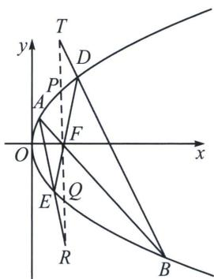

<!-- question-source:start -->
例7 (2025 苏州大学考前适应卷第 18 题(陪跑课学员汪小云提问))在平面直角坐标系 $xOy$ 中, 已知抛

物线 $\Gamma: y^{2}=4x$ 的焦点为 F，直线 $l_{1}$ 与 $\Gamma$ 交于 A，B 两点.

(1) 若 $l_{1}$ 过 F，另一条过 F 的直线 $l_{2}$ 与 $\Gamma$ 交于 D，E 两点 (A, D 在 x 轴上方)，直线 AE，BD 分别交直线 x = 1 于 R，T 两点，证明：F 为 RT 的中点；

(2) 若 $\Gamma$ 上存在点 $C$ , 使得 $\overrightarrow{FA} \cdot \overrightarrow{BC} = \overrightarrow{FB} \cdot \overrightarrow{AC} = 0$ , 证明: $\overrightarrow{FA} \cdot \overrightarrow{FB}$ 为定值.

(1) 设 $A\left(\frac{a^2}{4}, a\right), B\left(\frac{b^2}{4}, b\right), D\left(\frac{d^2}{4}, d\right), E\left(\frac{e^2}{4}, e\right)$ . $AB: y - y_A = \frac{y_B - y_A}{x_B - x_A} (x - x_A)$ ,

即 $(y_{A}+y_{B})y=4x+y_{A}y_{B}$ ，由于AB与DE都过焦点F，则 $y_{A}y_{B}=ab=-4$ ，即ab=-4，同理可得de=-4。又因为AE： $(a+e)y=4x+ae$ ，令x=1，得 $y_{R}=\frac{4+ae}{a+e}$ ，同理 $y_{T}=\frac{4+bd}{b+d}$ ，将 $b=-\frac{4}{a}$ ， $d=-\frac{4}{e}$ 代入得 $y_{T}=\frac{4+\frac{16}{ae}}{-\frac{4}{a}-\frac{4}{e}}=-\frac{4+ae}{a+e}=-y_{R}$ ，所以F为RT的中点。本问背景为蝴蝶定理，四边形ADBE中，由于交点F所在直线x=1截取抛物线两点P和Q，且F为PQ中点，所以 $|FT|=|FR|$ ；

(2)设 $C\left(\frac{c^2}{4}, c\right)$ ，因为 $\overrightarrow{FB} \cdot \overrightarrow{AC} = 0$ ，得 $\left(1 - \frac{b^2}{4}\right)\left(\frac{c^2}{4} - \frac{a^2}{4}\right) - b(c - a) = 0 \Leftrightarrow \left(1 - \frac{b^2}{4}\right)(c + a) - 4b = 0①$

由 $\overrightarrow{FA} \cdot \overrightarrow{BC} = 0$ ，得 $\left(1 - \frac{a^2}{4}\right)(b + c) - 4a = 0$ ②，由于 $\overrightarrow{FA} \cdot \overrightarrow{FB} = \left(\frac{a^2}{4} - 1\right)\left(\frac{b^2}{4} - 1\right) + ab$ ，故需要构造含有 $\left(\frac{a^2}{4} - 1\right)\left(\frac{b^2}{4} - 1\right)$ 的乘积式，由① $\times \left(1 - \frac{a^2}{4}\right) - ② \times \left(1 - \frac{b^2}{4}\right)$ 得： $\left(1 - \frac{a^2}{4}\right)\left(1 - \frac{b^2}{4}\right)(c + a) - 4b\left(1 - \frac{a^2}{4}\right) - \left(1 - \frac{a^2}{4}\right)\left(1 - \frac{b^2}{4}\right)(c + b) + 4a\left(1 - \frac{b^2}{4}\right) = 0,$

$$
\left(1 - \frac {a ^ {2}}{4}\right) \left(1 - \frac {b ^ {2}}{4}\right) a - 4 b \left(1 - \frac {a ^ {2}}{4}\right) - \left(1 - \frac {a ^ {2}}{4}\right) \left(1 - \frac {b ^ {2}}{4}\right) b + 4 a \left(1 - \frac {b ^ {2}}{4}\right) = 0
$$

即 $\left[\left(\frac{a^2}{4} - 1\right)\left(\frac{b^2}{4} - 1\right) + ab + 4\right](a - b) = 0$ 。因为 $a \neq b$ ，所以 $\left(\frac{a^2}{4} - 1\right)\left(\frac{b^2}{4} - 1\right) + ab + 4 = 0$

则 $\overrightarrow{FA} \cdot \overrightarrow{FB} = \left(\frac{a^2}{4} - 1\right)\left(\frac{b^2}{4} - 1\right) + ab = -4$ ，即 $\overrightarrow{FA} \cdot \overrightarrow{FB}$ 为定值-4.
<!-- question-source:end -->

![[高中/总复习/专题/2026版高中《mst老唐说题》圆锥曲线专题（数学）/上册/第06章_联立之同构方程/第一节_抛物线两点联立式方程/一_抛物线两点联立式同构与定点定值/例题/answers/Q00048601A1.md]]
