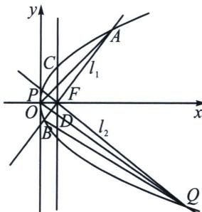

<!-- question-source:start -->
例8 (2025·河南郑州·三模T18)已知抛物线 $E: y^{2} = 2px (p > 0)$ 的焦点为 $F$ , 点 $M\left(\frac{5}{4}, y_{0}\right)$ 在 $E$ 上,且 $|MF| = \frac{7}{4}$ .

(1)求 E 的方程;

(2) 过 $F$ 作互相垂直的两条直线 $l_{1}, l_{2}$ , 这两条直线与抛物线 $C$ 分别交于 $A, B$ 和 $P, Q$ 两点, 其中点 $A, P$ 在第一象限.

(i) 记 $\triangle AOB$ 和 $\triangle POQ$ 的面积为 $S_{1}, S_{2}$ , 求 $S_{1} S_{2}$ 的最小值;

## 高中数学 新思路 圆锥曲线专题

（ii）过 $F$ 点作 $x$ 轴的垂线，分别交 $AP, BQ$ 于 $C, D$ 两点，请判断是否存在以 $CD$ 为直径的圆与 $y$ 轴相切，并说明理由.

(1)依题意得, 点 $M$ 在抛物线上, 且 $|MF| = \frac{7}{4}$ , 所以 $\frac{p}{2} + \frac{5}{4} = \frac{7}{4}$ , 所以可得 $p = 1$ , 所以 $E$ 的方程为 $y^{2} = 2x$ ;

(2)(i)抛物线方程为 $y^{2}=2x$ ，焦点坐标为 $F\left(\frac{1}{2},0\right)$ ，当 $l_{1}$ 的直线斜率为 0 时，与抛物线只有 1 个交点，不合要求，当 $l_{1}$ 的斜率不存在时， $l_{2}$ 的斜率为 0，此时 $l_{2}$ 与抛物线只有 1 个交点，不合要求，故设 $l_{1}:x=my+\frac{1}{2}, m\neq0$ ，则 $l_{2}:x=-\frac{1}{m}y+\frac{1}{2}, A(x_{1},y_{1}), B(x_{2},y_{2}), P(x_{3},y_{3}), Q(x_{4},y_{4})$ ，由 $\left\{\begin{aligned}y^{2}&=2x,\\ x&=my+\frac{1}{2},\end{aligned}\right.$ ，消去 x 得 $y^{2}-2my-1=0,\Delta=m^{2}+4>0,y_{1}+y_{2}=2m,y_{1}y_{2}=-1$ ，所以 $S_{1}=\frac{1}{2}|OF|$ $|y_{1}-y_{2}|=\frac{1}{4}\sqrt{(y_{1}+y_{2})^{2}-4y_{1}y_{2}}=\frac{1}{4}\sqrt{4m^{2}+4}=\frac{1}{2}\sqrt{m^{2}+1}$

同理 $S_{2} = \frac{1}{2}\sqrt{\frac{1}{m^{2}} + 1}$ ，所以 $S_{1}S_{2} = \frac{1}{4}\sqrt{(m^{2} + 1)\left(\frac{1}{m^{2}} + 1\right)} = \frac{1}{4}\sqrt{m^{2} + \frac{1}{m^{2}} + 2} \geqslant \frac{1}{4}\sqrt{2m \cdot \frac{1}{m} + 2} = \frac{1}{2}$ ，当且仅当 $m^{2} = \frac{1}{m^{2}}$ ，即 $m = \pm 1$ 时等号成立，故 $S_{1}S_{2}$ 的最小值为 $\frac{1}{2}$ .

(ii) 不妨设 $m > 0$ ，由题意可知 $l_{AP}: y - y_1 = \frac{y_1 - y_3}{x_1 - x_3} (x - x_1)$ ，

又 $y_{1}^{2} = 2x_{1}$ ， $y_{3}^{2} = 2x_{3}$ ，所以AP的直线方程可化为： $y - y_{1} = \frac{2}{y_{1} + y_{3}} (x - x_{1})$

又 $x_{C} = \frac{1}{2}$ ，故可得 $y_{C} = \frac{1 + y_{1}y_{3}}{y_{1} + y_{3}}$ ，同理可得直线 $BQ$ 的方程为 $y - y_{2} = \frac{2}{y_{2} + y_{4}} (x - x_{2})$

又 $x_{D} = \frac{1}{2}$ ，故 $y_{D} = \frac{1 + y_{2}y_{4}}{y_{2} + y_{4}}$ ，又 $y_{1}y_{2} = y_{3}y_{4} = -1$ ，所以可得 $y_{D} = \frac{1 + \left(-\frac{1}{y_1}\right)\left(-\frac{1}{y_3}\right)}{-\frac{1}{y_1} - \frac{1}{y_3}} = -\frac{1 + y_1y_3}{y_1 + y_3},$

可得 $y_{C} + y_{D} = 0$ ，所以可得 CD 的中点恒为 F，以 CD 为直径的圆与 y 轴相切等价于 $y_{C} = \frac{1}{2}$ ，若 $y_{C} = \frac{1}{2}$ ，则 $\frac{1}{2} = \frac{1 + y_{1}y_{3}}{y_{1} + y_{3}}$ ，所以 $2y_{1}y_{3} + 2 = y_{1} + y_{3}$ ，又 $l_{1} \perp l_{2}$ ，所以 $\frac{2}{y_{1} + y_{2}} \cdot \frac{2}{y_{3} + y_{4}} = -1$ ，故 $\left(y_{1} - \frac{1}{y_{1}}\right)\left(y_{3} - \frac{1}{y_{3}}\right) = -4$ ，整理可得 $(y_{1}y_{3})^{2} - (y_{1}^{2} + y_{3}^{2}) + 1 = -4y_{1}y_{3}$ ，即 $(y_{1}y_{3} + 1)^{2} = (y_{1} - y_{3})^{2}$ ，因为 m > 0，故 $y_{1} > y_{3}$ ，所以 $y_{1}y_{3} + 1 = y_{1} - y_{3}$ 。又 $2y_{1}y_{3} + 2 = y_{1} + y_{3}$ ，故可得 $y_{1} = 3y_{3}$ 。

代入方程 $y_{1}y_{3} + 1 = y_{1} - y_{3}$ 可得， $3y_{3}^{2} - 2y_{3} + 1 = 0$ ， $\Delta = 4 - 12 = -8 < 0$ ，故不存在以 $CD$ 为直径的圆与 $y$ 轴相切.
<!-- question-source:end -->

![[高中/总复习/专题/2026版高中《mst老唐说题》圆锥曲线专题（数学）/上册/第06章_联立之同构方程/第一节_抛物线两点联立式方程/一_抛物线两点联立式同构与定点定值/例题/answers/Q00048602A1.md]]
