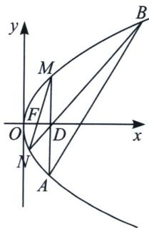

<!-- question-source:start -->
例3 (2022·全国甲卷)已知抛物线 $C: y^{2} = 2px (p > 0)$ 焦点为 $F$ , 点 $D(p, 0)$ 过焦点 $F$ 做直线 $l$ 交抛物线于 $M, N$ 两点, 当 $MD \perp x$ 轴时, $|MF| = 3$ .

(1)求抛物线方程

(2)若直线 $MD, ND$ 与抛物线的另一个交点分别为 $A, B$ . 若直线 $MN, AB$ 的倾斜角为 $\alpha, \beta$ , 当 $\alpha - \beta$ 最大时, 求 $AB$ 的方程

##
<!-- question-source:end -->

![[高中/总复习/专题/2026版高中《mst老唐说题》圆锥曲线专题（数学）/上册/第06章_联立之同构方程/第一节_抛物线两点联立式方程/一_抛物线两点联立式同构与定点定值/例题/answers/Q00053007A1.md]]
